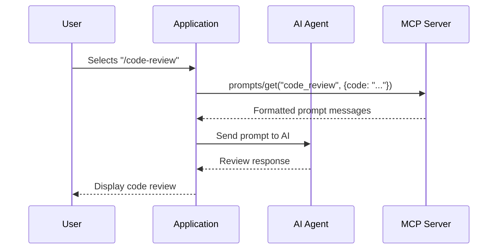

# Prompts

Prompts are **user-controlled** templates that provide predefined workflows for AI interactions.

## Overview

Prompts differ from tools and resources in their control model:

| Primitive | Control | Initiated By |
|-----------|---------|--------------|
| Tools | Model-controlled | AI decides |
| Resources | Application-controlled | App decides |
| **Prompts** | **User-controlled** | **User decides** |

Prompts are typically exposed as:
- Slash commands (`/summarize`)
- Menu items in UI
- Quick actions



## Prompt Definition

```json
{
  "name": "code_review",
  "description": "Perform a code review with specific focus areas",
  "arguments": [
    {
      "name": "code",
      "description": "The code to review",
      "required": true
    },
    {
      "name": "focus",
      "description": "Areas to focus on (security, performance, style)",
      "required": false
    }
  ]
}
```

### Properties

| Property | Type | Required | Description |
|----------|------|----------|-------------|
| `name` | string | Yes | Unique identifier |
| `description` | string | No | Human-readable description |
| `arguments` | array | No | Input parameters |

### Argument Properties

| Property | Type | Required | Description |
|----------|------|----------|-------------|
| `name` | string | Yes | Argument name |
| `description` | string | No | Description for UI |
| `required` | boolean | No | Is argument required? |

## Protocol Operations

### List Prompts

```json
// Request
{
  "jsonrpc": "2.0",
  "id": 1,
  "method": "prompts/list"
}

// Response
{
  "jsonrpc": "2.0",
  "id": 1,
  "result": {
    "prompts": [
      {
        "name": "code_review",
        "description": "Review code for issues",
        "arguments": [...]
      },
      {
        "name": "summarize",
        "description": "Summarize content",
        "arguments": [...]
      }
    ]
  }
}
```

### Get Prompt

```json
// Request
{
  "jsonrpc": "2.0",
  "id": 2,
  "method": "prompts/get",
  "params": {
    "name": "code_review",
    "arguments": {
      "code": "function add(a, b) { return a + b; }",
      "focus": "performance"
    }
  }
}

// Response
{
  "jsonrpc": "2.0",
  "id": 2,
  "result": {
    "description": "Code review focusing on performance",
    "messages": [
      {
        "role": "user",
        "content": {
          "type": "text",
          "text": "Please review the following code with a focus on performance:\n\n```javascript\nfunction add(a, b) { return a + b; }\n```\n\nProvide specific suggestions for improvement."
        }
      }
    ]
  }
}
```

## Message Structure

Prompts return an array of messages ready for the AI:

```json
{
  "messages": [
    {
      "role": "user",
      "content": {
        "type": "text",
        "text": "Review this code..."
      }
    }
  ]
}
```

### Content Types

Prompt messages can include:

**Text**
```json
{
  "type": "text",
  "text": "Analyze this code for security issues."
}
```

**Images**
```json
{
  "type": "image",
  "data": "base64-encoded-image",
  "mimeType": "image/png"
}
```

**Embedded Resources**
```json
{
  "type": "resource",
  "resource": {
    "uri": "file:///project/src/main.ts",
    "mimeType": "text/typescript",
    "text": "// File contents..."
  }
}
```

## Implementing Prompts in PHP

```php
<?php

use Mcp\Capability\Attribute\McpPrompt;

class CodePrompts
{
    #[McpPrompt(
        name: 'code_review',
        description: 'Review code for issues and improvements'
    )]
    public function codeReview(
        string $code,
        ?string $focus = null,
        ?string $language = null
    ): array {
        $focusText = $focus
            ? "Focus particularly on: {$focus}"
            : "Cover all aspects: security, performance, readability, and best practices";

        $languageHint = $language
            ? "The code is written in {$language}."
            : "";

        return [
            [
                'role' => 'user',
                'content' => [
                    'type' => 'text',
                    'text' => <<<PROMPT
                    Please review the following code:

                    ```
                    {$code}
                    ```

                    {$languageHint}

                    {$focusText}

                    Provide:
                    1. Summary of what the code does
                    2. Identified issues (if any)
                    3. Specific improvement suggestions
                    4. Overall quality assessment
                    PROMPT
                ]
            ]
        ];
    }

    #[McpPrompt(
        name: 'summarize_document',
        description: 'Summarize a document or text'
    )]
    public function summarize(
        string $content,
        ?string $style = 'concise'
    ): array {
        $styleInstructions = match($style) {
            'detailed' => 'Provide a comprehensive summary with key details.',
            'bullet' => 'Use bullet points for the main takeaways.',
            'executive' => 'Write an executive summary suitable for leadership.',
            default => 'Provide a concise 2-3 sentence summary.',
        };

        return [
            [
                'role' => 'user',
                'content' => [
                    'type' => 'text',
                    'text' => "Summarize the following content:\n\n{$content}\n\n{$styleInstructions}"
                ]
            ]
        ];
    }

    #[McpPrompt(
        name: 'explain_concept',
        description: 'Explain a technical concept'
    )]
    public function explain(
        string $concept,
        ?string $audience = 'developer'
    ): array {
        $audienceContext = match($audience) {
            'beginner' => 'Explain as if to someone new to programming.',
            'manager' => 'Explain in non-technical terms for a business audience.',
            'expert' => 'Provide an in-depth technical explanation.',
            default => 'Explain for an experienced developer.',
        };

        return [
            [
                'role' => 'user',
                'content' => [
                    'type' => 'text',
                    'text' => "Explain: {$concept}\n\n{$audienceContext}"
                ]
            ]
        ];
    }
}
```

## Embedding Resources in Prompts

Prompts can reference MCP resources:

```php
#[McpPrompt(name: 'analyze_file')]
public function analyzeFile(string $filePath): array
{
    // Read the file resource
    $content = $this->resourceManager->read("file://{$filePath}");

    return [
        [
            'role' => 'user',
            'content' => [
                'type' => 'resource',
                'resource' => [
                    'uri' => "file://{$filePath}",
                    'mimeType' => $content['mimeType'],
                    'text' => $content['text']
                ]
            ]
        ],
        [
            'role' => 'user',
            'content' => [
                'type' => 'text',
                'text' => 'Analyze this file and provide insights.'
            ]
        ]
    ];
}
```

## Rea UI Integration

In Rea, prompts could be exposed as slash commands:

```typescript
// Frontend: Register prompt commands
const promptCommands = await mcpClient.listPrompts();

promptCommands.forEach(prompt => {
  registerSlashCommand({
    name: prompt.name,
    description: prompt.description,
    arguments: prompt.arguments,
    execute: async (args) => {
      const messages = await mcpClient.getPrompt(prompt.name, args);
      return sendToAgent(messages);
    }
  });
});
```

Users would interact via:
- `/code-review [paste code]`
- `/summarize [paste text]`
- `/explain [concept]`

## Best Practices

### 1. Clear, Action-Oriented Names

```
✓ code_review
✓ summarize_document
✓ generate_tests

✗ review
✗ summary
✗ tests
```

### 2. Descriptive Arguments

```php
#[McpPrompt(name: 'translate')]
public function translate(
    string $text,        // The content to translate
    string $targetLang,  // Target language (e.g., "Spanish", "French")
    ?string $tone = null // Optional: formal, casual, technical
): array { ... }
```

### 3. Validate Inputs

```php
#[McpPrompt(name: 'code_review')]
public function codeReview(string $code): array
{
    if (strlen($code) > 50000) {
        throw new InvalidArgumentException(
            'Code exceeds maximum length of 50,000 characters'
        );
    }

    if (empty(trim($code))) {
        throw new InvalidArgumentException(
            'Code cannot be empty'
        );
    }

    return $this->buildPrompt($code);
}
```

### 4. Provide Sensible Defaults

```php
#[McpPrompt(name: 'summarize')]
public function summarize(
    string $content,
    string $style = 'concise',     // Default to concise
    int $maxLength = 500,          // Default max length
    string $language = 'English'   // Default output language
): array { ... }
```

### 5. Support Multi-Turn Conversations

```php
#[McpPrompt(name: 'interactive_review')]
public function interactiveReview(string $code): array
{
    return [
        [
            'role' => 'user',
            'content' => [
                'type' => 'text',
                'text' => "I'd like you to review this code: {$code}"
            ]
        ],
        [
            'role' => 'assistant',
            'content' => [
                'type' => 'text',
                'text' => "I'll review this code. Before I begin, could you tell me:\n1. What is the purpose of this code?\n2. Are there specific concerns you have?\n3. What's the target environment?"
            ]
        ]
    ];
}
```

## Dynamic Prompts

Prompts can change based on server state:

```php
#[McpPrompt(name: 'daily_standup')]
public function dailyStandup(): array
{
    // Fetch recent activity
    $recentTasks = $this->taskService->getRecentTasks();
    $blockers = $this->taskService->getBlockers();

    $taskList = implode("\n", array_map(
        fn($t) => "- {$t['title']} ({$t['status']})",
        $recentTasks
    ));

    return [
        [
            'role' => 'user',
            'content' => [
                'type' => 'text',
                'text' => "Help me prepare my daily standup. Here's my recent work:\n\n{$taskList}\n\nBlockers: " . (count($blockers) > 0 ? implode(", ", $blockers) : "None")
            ]
        ]
    ];
}
```

---

## Next Steps

- [Transports](transports.md) - How MCP communicates
- [PHP Server Implementation](../implementation/php-server.md) - Build custom prompts
- [Notion Tutorial](../tutorials/notion-mcp.md) - See prompts in action
