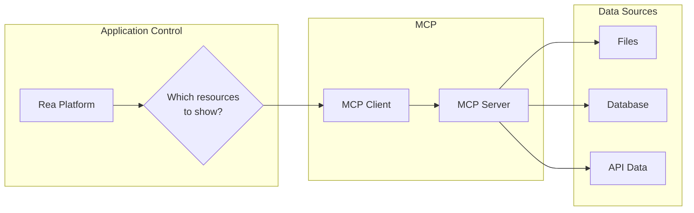

# Resources

Resources are **application-controlled** data sources that provide context to AI agents.

## Overview

While tools let AI agents take actions, resources provide read-only access to data. The key difference is control:

| Aspect | Tools | Resources |
|--------|-------|-----------|
| **Control** | Model decides when to use | Application decides what to expose |
| **Operation** | Read/Write | Read-only |
| **Interaction** | AI invokes directly | Application surfaces to AI |
| **Use Case** | Actions and computations | Context and information |



## Resource Structure

Each resource is identified by a unique URI:

```json
{
  "uri": "notion://workspace/pages/abc123",
  "name": "Project Roadmap",
  "description": "Q4 2024 product roadmap",
  "mimeType": "application/json",
  "annotations": {
    "audience": ["user"],
    "priority": 0.9
  }
}
```

### URI Schemes

Resources use URIs following RFC 3986:

| Scheme | Purpose | Example |
|--------|---------|---------|
| `file://` | Local files | `file:///home/user/doc.md` |
| `https://` | Web resources | `https://api.example.com/data` |
| `notion://` | Notion content | `notion://workspace/pages/abc123` |
| `db://` | Database records | `db://users/123` |

## Resource Types

### Static Resources

Fixed resources that don't change frequently:

```json
{
  "uri": "config://app/settings",
  "name": "Application Settings",
  "mimeType": "application/json"
}
```

### Dynamic Resources (Templates)

Resources with variable URIs:

```json
{
  "uriTemplate": "notion://pages/{pageId}",
  "name": "Notion Page",
  "description": "Retrieve any Notion page by ID",
  "mimeType": "application/json"
}
```

## Protocol Operations

### List Resources

```json
// Request
{
  "jsonrpc": "2.0",
  "id": 1,
  "method": "resources/list"
}

// Response
{
  "jsonrpc": "2.0",
  "id": 1,
  "result": {
    "resources": [
      {
        "uri": "notion://workspace/pages/abc123",
        "name": "Project Roadmap",
        "mimeType": "application/json"
      }
    ]
  }
}
```

### Read Resource

```json
// Request
{
  "jsonrpc": "2.0",
  "id": 2,
  "method": "resources/read",
  "params": {
    "uri": "notion://workspace/pages/abc123"
  }
}

// Response
{
  "jsonrpc": "2.0",
  "id": 2,
  "result": {
    "contents": [
      {
        "uri": "notion://workspace/pages/abc123",
        "mimeType": "application/json",
        "text": "{\"title\": \"Project Roadmap\", \"content\": \"...\"}"
      }
    ]
  }
}
```

### List Templates

```json
// Request
{
  "jsonrpc": "2.0",
  "id": 3,
  "method": "resources/templates/list"
}

// Response
{
  "jsonrpc": "2.0",
  "id": 3,
  "result": {
    "resourceTemplates": [
      {
        "uriTemplate": "notion://pages/{pageId}",
        "name": "Notion Page",
        "mimeType": "application/json"
      }
    ]
  }
}
```

## Resource Subscriptions

Clients can subscribe to resource changes:

```json
// Subscribe
{
  "jsonrpc": "2.0",
  "id": 4,
  "method": "resources/subscribe",
  "params": {
    "uri": "notion://workspace/pages/abc123"
  }
}

// Server notification on change
{
  "jsonrpc": "2.0",
  "method": "notifications/resources/updated",
  "params": {
    "uri": "notion://workspace/pages/abc123"
  }
}
```

## Implementing Resources in PHP

```php
<?php

use Mcp\Capability\Attribute\McpResource;

class NotionResources
{
    #[McpResource(
        uri: 'notion://workspace/info',
        name: 'Workspace Information',
        mimeType: 'application/json'
    )]
    public function getWorkspaceInfo(): array
    {
        $user = $this->notionClient->users()->me();

        return [
            'user' => $user['name'],
            'workspace' => $user['workspace_name'] ?? 'Unknown',
            'type' => $user['type'],
        ];
    }

    #[McpResource(
        uri: 'notion://pages/{pageId}',
        name: 'Notion Page',
        mimeType: 'application/json',
        isTemplate: true
    )]
    public function getPage(string $pageId): array
    {
        $page = $this->notionClient->pages()->retrieve($pageId);
        $blocks = $this->notionClient->blocks()->children()->list($pageId);

        return [
            'id' => $page['id'],
            'title' => $this->extractTitle($page),
            'properties' => $page['properties'],
            'content' => $this->formatBlocks($blocks),
            'url' => $page['url'],
        ];
    }

    #[McpResource(
        uri: 'notion://databases/{databaseId}/schema',
        name: 'Database Schema',
        mimeType: 'application/json',
        isTemplate: true
    )]
    public function getDatabaseSchema(string $databaseId): array
    {
        $db = $this->notionClient->databases()->retrieve($databaseId);

        return [
            'id' => $db['id'],
            'title' => $this->extractTitle($db),
            'properties' => array_map(fn($prop) => [
                'name' => $prop['name'],
                'type' => $prop['type'],
            ], $db['properties']),
        ];
    }
}
```

## Content Types

Resources can return different content types:

### Text Content

```json
{
  "uri": "file:///docs/readme.md",
  "mimeType": "text/markdown",
  "text": "# Project README\n\nThis is the documentation..."
}
```

### Binary Content

```json
{
  "uri": "file:///images/logo.png",
  "mimeType": "image/png",
  "blob": "base64-encoded-data..."
}
```

## Resource Annotations

Annotations provide metadata to help applications:

```json
{
  "uri": "notion://pages/abc123",
  "annotations": {
    "audience": ["user", "assistant"],
    "priority": 0.8,
    "lastModified": "2024-01-15T10:30:00Z"
  }
}
```

| Annotation | Type | Description |
|------------|------|-------------|
| `audience` | array | Who should see: `user`, `assistant` |
| `priority` | number | 0.0-1.0, higher = more relevant |

## Best Practices

### 1. Use Descriptive URIs

```
✓ notion://workspace/pages/abc123
✓ file:///project/src/main.ts
✓ db://users/123/profile

✗ resource://1
✗ data://x
```

### 2. Appropriate MIME Types

```
✓ application/json - Structured data
✓ text/markdown - Documentation
✓ text/plain - Simple text
✓ image/png - Images

✗ application/octet-stream (unless truly binary)
```

### 3. Efficient Resource Loading

```php
#[McpResource(uri: 'notion://pages/{pageId}')]
public function getPage(string $pageId): array
{
    // Use caching for frequently accessed resources
    $cacheKey = "notion_page_{$pageId}";

    return Cache::remember($cacheKey, 300, function () use ($pageId) {
        return $this->fetchPage($pageId);
    });
}
```

### 4. Handle Missing Resources

```php
public function getPage(string $pageId): array
{
    try {
        return $this->notionClient->pages()->retrieve($pageId);
    } catch (NotFoundException $e) {
        throw new ResourceNotFoundException(
            "Page not found: {$pageId}",
            uri: "notion://pages/{$pageId}"
        );
    }
}
```

### 5. Implement Pagination

For large resource lists:

```json
{
  "jsonrpc": "2.0",
  "id": 1,
  "method": "resources/list",
  "params": {
    "cursor": "eyJwYWdlIjogMn0="
  }
}

// Response includes nextCursor
{
  "result": {
    "resources": [...],
    "nextCursor": "eyJwYWdlIjogM30="
  }
}
```

## When to Use Resources vs Tools

| Use Resources When | Use Tools When |
|--------------------|----------------|
| Providing context | Taking actions |
| Read-only access | Modifying data |
| Application controls visibility | AI decides what to use |
| Static or semi-static data | Dynamic operations |
| Bulk data exposure | Specific queries |

---

## Next Steps

- [Prompts](prompts.md) - User-controlled workflow templates
- [Transports](transports.md) - Communication mechanisms
- [PHP Server Implementation](../implementation/php-server.md) - Build your own resources
