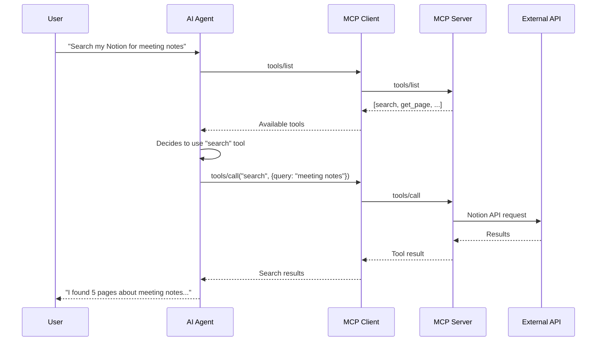

# Tools

Tools are **model-controlled** functions that enable AI agents to perform actions and computations.

## Overview

Tools are the primary way AI agents interact with external systems through MCP. When an MCP server exposes tools, AI models can discover and invoke them to accomplish tasks.



## Tool Definition

Tools are defined with a JSON Schema:

```json
{
  "name": "search_pages",
  "description": "Search for pages by title or content",
  "inputSchema": {
    "type": "object",
    "properties": {
      "query": {
        "type": "string",
        "description": "Search query"
      },
      "limit": {
        "type": "integer",
        "description": "Maximum results",
        "default": 10
      }
    },
    "required": ["query"]
  }
}
```

### Required Properties

| Property | Type | Description |
|----------|------|-------------|
| `name` | string | Unique identifier (max 64 chars) |
| `description` | string | Human-readable description |
| `inputSchema` | object | JSON Schema for parameters |

### Optional Properties

| Property | Type | Description |
|----------|------|-------------|
| `title` | string | Display name for UI |
| `annotations` | object | Metadata (audience, priority) |

## Tool Execution Flow

### 1. Discovery

The client requests available tools:

```json
// Request
{
  "jsonrpc": "2.0",
  "id": 1,
  "method": "tools/list"
}

// Response
{
  "jsonrpc": "2.0",
  "id": 1,
  "result": {
    "tools": [
      {
        "name": "search_pages",
        "description": "Search for pages",
        "inputSchema": {...}
      }
    ]
  }
}
```

### 2. Invocation

The AI model calls the tool:

```json
// Request
{
  "jsonrpc": "2.0",
  "id": 2,
  "method": "tools/call",
  "params": {
    "name": "search_pages",
    "arguments": {
      "query": "meeting notes",
      "limit": 5
    }
  }
}
```

### 3. Response

The server returns results:

```json
{
  "jsonrpc": "2.0",
  "id": 2,
  "result": {
    "content": [
      {
        "type": "text",
        "text": "{\"results\": [{\"id\": \"abc123\", \"title\": \"Meeting Notes\"}]}"
      }
    ],
    "isError": false
  }
}
```

## Content Types

Tool responses can include multiple content types:

### Text Content

```json
{
  "type": "text",
  "text": "Search completed. Found 5 results."
}
```

### Image Content

```json
{
  "type": "image",
  "data": "base64-encoded-image-data",
  "mimeType": "image/png"
}
```

### Resource Links

```json
{
  "type": "resource",
  "resource": {
    "uri": "file:///path/to/document.pdf",
    "mimeType": "application/pdf"
  }
}
```

## Implementing Tools in PHP

Using the MCP PHP SDK:

```php
<?php

use Mcp\Capability\Attribute\McpTool;

class NotionTools
{
    #[McpTool(
        name: 'search_pages',
        description: 'Search for Notion pages by query'
    )]
    public function searchPages(
        string $query,
        int $limit = 10
    ): array {
        // Implementation
        $results = $this->notionClient->search([
            'query' => $query,
            'page_size' => $limit,
        ]);

        return [
            'results' => array_map(fn($page) => [
                'id' => $page['id'],
                'title' => $this->extractTitle($page),
                'url' => $page['url'],
            ], $results['results']),
        ];
    }

    #[McpTool(
        name: 'get_page',
        description: 'Get a Notion page by ID'
    )]
    public function getPage(string $pageId): array
    {
        $page = $this->notionClient->pages()->retrieve($pageId);

        return [
            'id' => $page['id'],
            'title' => $this->extractTitle($page),
            'properties' => $page['properties'],
            'created_time' => $page['created_time'],
            'last_edited_time' => $page['last_edited_time'],
        ];
    }
}
```

## Best Practices

### 1. Clear Naming

Use descriptive, action-oriented names:

```
✓ search_pages
✓ create_task
✓ send_message

✗ pages
✗ task
✗ msg
```

### 2. Detailed Descriptions

Help the AI understand when to use the tool:

```
✓ "Search for Notion pages by title or content. Returns matching pages
   with their IDs, titles, and URLs. Use this to find specific documents."

✗ "Search pages"
```

### 3. Input Validation

Always validate inputs before execution:

```php
#[McpTool]
public function searchPages(string $query, int $limit = 10): array
{
    // Validate
    if (strlen($query) < 2) {
        throw new InvalidArgumentException(
            'Query must be at least 2 characters'
        );
    }

    if ($limit < 1 || $limit > 100) {
        $limit = min(max($limit, 1), 100);
    }

    // Execute
    return $this->doSearch($query, $limit);
}
```

### 4. Error Handling

Return structured errors:

```php
try {
    $result = $this->executeOperation();
    return ['success' => true, 'data' => $result];
} catch (ApiException $e) {
    return [
        'success' => false,
        'error' => $e->getMessage(),
        'code' => $e->getCode(),
    ];
}
```

### 5. Human-in-the-Loop

For destructive operations, require confirmation:

```php
#[McpTool(
    name: 'delete_page',
    description: 'Delete a Notion page. DESTRUCTIVE - requires confirmation.'
)]
public function deletePage(
    string $pageId,
    bool $confirmed = false
): array {
    if (!$confirmed) {
        return [
            'status' => 'confirmation_required',
            'message' => 'Please confirm deletion by calling with confirmed=true',
        ];
    }

    $this->notionClient->pages()->delete($pageId);
    return ['status' => 'deleted', 'pageId' => $pageId];
}
```

## Tool Change Notifications

Servers can notify clients when tools change:

```json
{
  "jsonrpc": "2.0",
  "method": "notifications/tools/list_changed"
}
```

Clients should re-fetch the tool list when receiving this notification.

## Security Considerations

1. **Rate Limiting**: Implement rate limits to prevent abuse
2. **Input Sanitization**: Sanitize all user inputs
3. **Audit Logging**: Log all tool executions
4. **Permission Checks**: Verify user has access to requested resources
5. **Timeout Handling**: Set reasonable timeouts for external API calls

---

## Next Steps

- [Resources](resources.md) - Application-controlled data access
- [Prompts](prompts.md) - User-controlled workflow templates
- [PHP Server Implementation](../implementation/php-server.md) - Build your own tools
