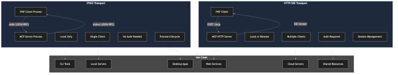
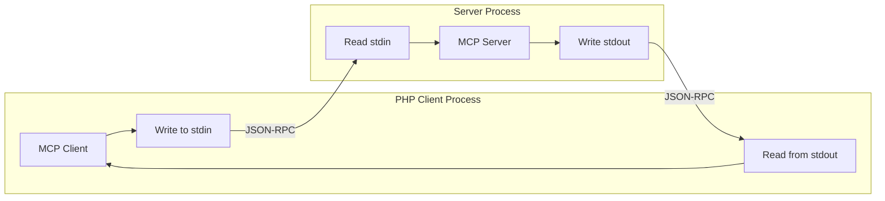
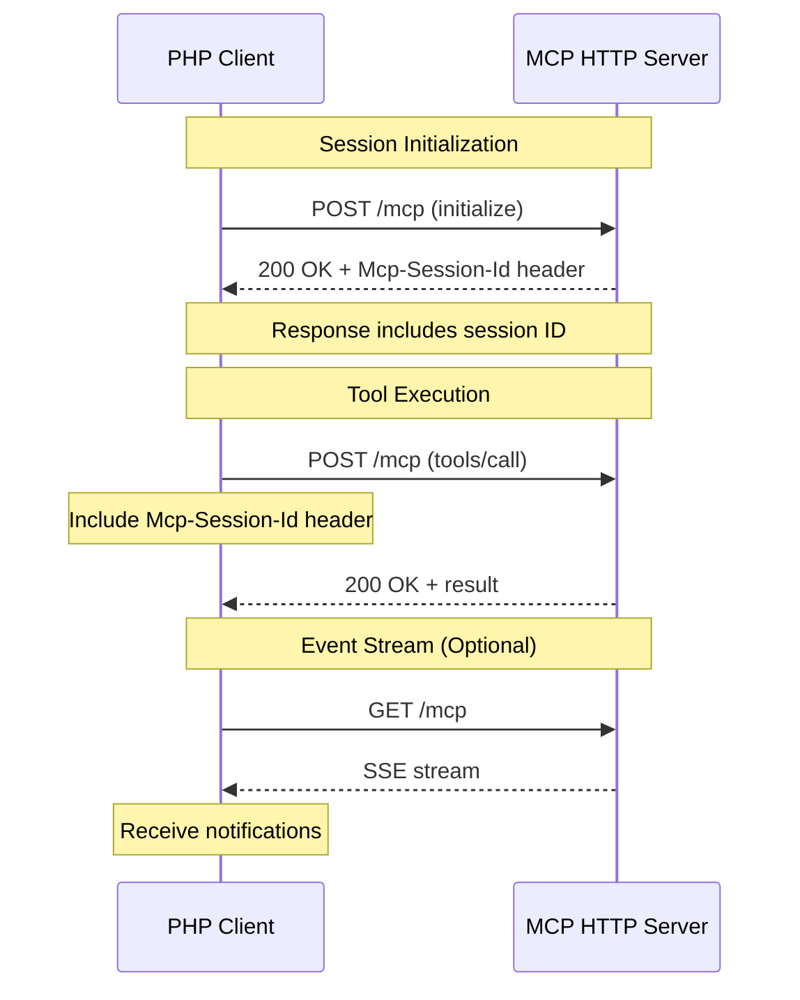
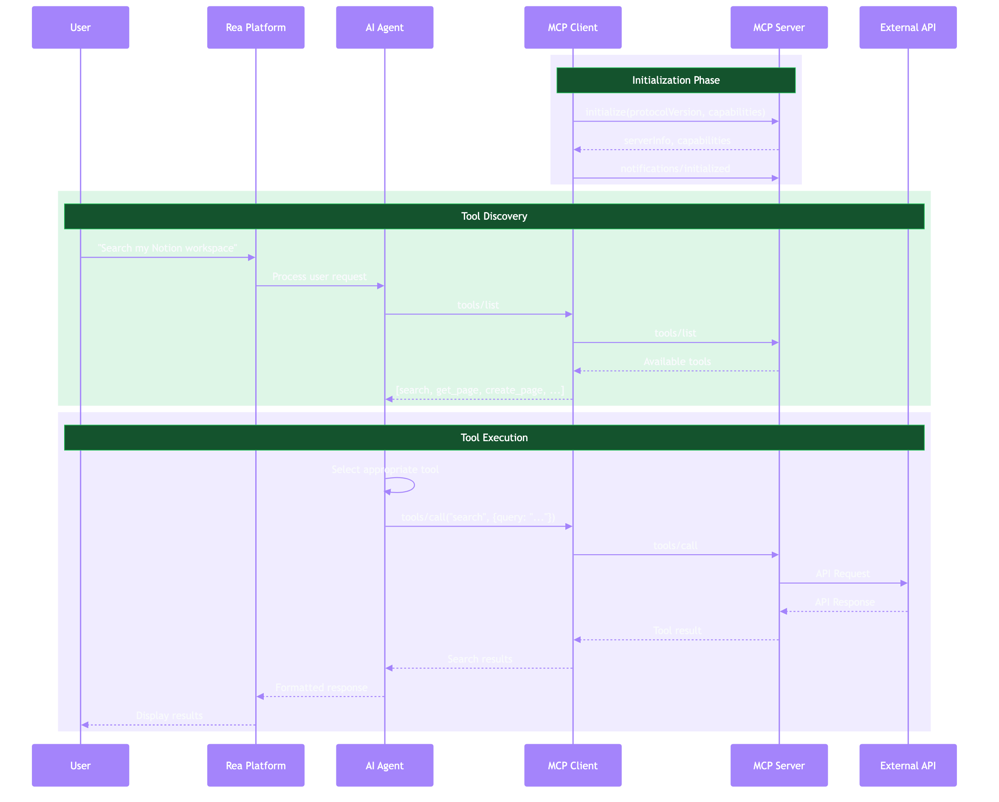

# Transports

Transports define how MCP clients and servers communicate. MCP supports two primary transport mechanisms.



## Overview

| Transport | Use Case | Latency | Setup Complexity |
|-----------|----------|---------|------------------|
| **stdio** | Local processes | Low | Simple |
| **HTTP/SSE** | Remote servers | Medium | Moderate |

## stdio Transport

The **stdio** (standard input/output) transport runs the MCP server as a subprocess, communicating via standard streams.

### How It Works



### PHP Implementation

```php
<?php

use Symfony\Component\Process\Process;

class StdioTransport
{
    private Process $process;
    private $stdin;
    private $stdout;

    public function __construct(
        private string $command,
        private array $args = [],
        private array $env = []
    ) {}

    public function connect(): void
    {
        $fullCommand = array_merge([$this->command], $this->args);

        $this->process = new Process($fullCommand);
        $this->process->setEnv(array_merge($_ENV, $this->env));
        $this->process->setTimeout(null);
        $this->process->start();

        // Get streams
        $this->stdin = $this->process->getInput();
        $this->stdout = $this->process->getOutput();
    }

    public function send(array $message): void
    {
        $json = json_encode($message) . "\n";
        fwrite($this->stdin, $json);
        fflush($this->stdin);
    }

    public function receive(): ?array
    {
        $line = fgets($this->stdout);

        if ($line === false) {
            return null;
        }

        return json_decode(trim($line), true);
    }

    public function close(): void
    {
        $this->process->stop(3);
    }
}
```

### Configuration Example

```php
$config = [
    'transport' => 'stdio',
    'command' => 'npx',
    'args' => ['-y', '@notionhq/notion-mcp-server'],
    'env' => [
        'NOTION_TOKEN' => env('NOTION_TOKEN'),
    ],
];
```

### Advantages

- **Simple setup** - Just start a process
- **Low latency** - Direct pipe communication
- **Secure** - No network exposure
- **Self-contained** - Server lifecycle tied to client

### Limitations

- **Single client** - One client per server process
- **Local only** - Cannot run on remote machines
- **Process management** - Must handle crashes/restarts

---

## HTTP/SSE Transport

The **Streamable HTTP** transport enables remote communication using HTTP POST for requests and Server-Sent Events (SSE) for notifications.

### How It Works



### PHP Implementation

```php
<?php

use GuzzleHttp\Client;
use GuzzleHttp\Psr7\Request;

class HttpTransport
{
    private Client $client;
    private ?string $sessionId = null;
    private ?string $eventStreamUrl = null;

    public function __construct(
        private string $baseUrl,
        private array $headers = []
    ) {
        $this->client = new Client([
            'base_uri' => $this->baseUrl,
            'timeout' => 30,
        ]);
    }

    public function connect(): void
    {
        // Initial request to establish session
        $response = $this->send([
            'jsonrpc' => '2.0',
            'id' => 1,
            'method' => 'initialize',
            'params' => [
                'protocolVersion' => '2024-11-05',
                'capabilities' => [],
                'clientInfo' => [
                    'name' => 'rea-mcp-client',
                    'version' => '1.0.0',
                ],
            ],
        ]);

        // Extract session ID from response headers
        $this->sessionId = $response->getHeader('Mcp-Session-Id')[0] ?? null;
    }

    public function send(array $message): array
    {
        $headers = array_merge($this->headers, [
            'Content-Type' => 'application/json',
        ]);

        if ($this->sessionId !== null) {
            $headers['Mcp-Session-Id'] = $this->sessionId;
        }

        $response = $this->client->post('/mcp', [
            'headers' => $headers,
            'json' => $message,
        ]);

        return json_decode($response->getBody()->getContents(), true);
    }

    public function openEventStream(callable $onMessage): void
    {
        $headers = [
            'Accept' => 'text/event-stream',
            'Mcp-Session-Id' => $this->sessionId,
        ];

        $response = $this->client->get('/mcp', [
            'headers' => $headers,
            'stream' => true,
        ]);

        $body = $response->getBody();

        while (!$body->eof()) {
            $line = $body->read(1024);
            if (str_starts_with($line, 'data: ')) {
                $data = json_decode(substr($line, 6), true);
                $onMessage($data);
            }
        }
    }

    public function close(): void
    {
        if ($this->sessionId !== null) {
            $this->client->delete('/mcp', [
                'headers' => ['Mcp-Session-Id' => $this->sessionId],
            ]);
        }
    }
}
```

### Configuration Example

```php
$config = [
    'transport' => 'http',
    'url' => 'https://mcp.example.com',
    'headers' => [
        'Authorization' => 'Bearer ' . env('MCP_AUTH_TOKEN'),
    ],
    'timeout' => 30,
];
```

### HTTP Endpoints

| Endpoint | Method | Purpose |
|----------|--------|---------|
| `/mcp` | POST | Send JSON-RPC requests |
| `/mcp` | GET | Open SSE stream for notifications |
| `/mcp` | DELETE | Close session |
| `/health` | GET | Health check (no auth required) |

### Headers

| Header | Direction | Description |
|--------|-----------|-------------|
| `Mcp-Session-Id` | Both | Session identifier |
| `Mcp-Protocol-Version` | Request | Protocol version |
| `Last-Event-ID` | Request | Resume SSE from event |

### Advantages

- **Remote access** - Connect to servers anywhere
- **Multi-client** - Multiple clients per server
- **Scalable** - Standard HTTP infrastructure
- **Resumable** - SSE supports reconnection

### Limitations

- **Authentication required** - Must implement auth
- **Network latency** - Higher than stdio
- **Session management** - Must handle sessions

---

## Choosing a Transport

### Use stdio When

- Server runs on the same machine
- Single client connection is sufficient
- You want simple deployment
- Security is paramount (no network exposure)

### Use HTTP When

- Server needs to run remotely
- Multiple clients need simultaneous access
- You need to scale horizontally
- Building a shared service

## Security Considerations

### stdio Security

```php
// Ensure no debug output on stdout
ini_set('display_errors', '0');
error_reporting(0);

// Redirect errors to stderr
ini_set('error_log', 'php://stderr');
```

### HTTP Security

```php
// Validate origin header
$origin = $request->getHeader('Origin')[0] ?? '';
if (!in_array($origin, $allowedOrigins)) {
    return new Response(403, [], 'Forbidden');
}

// Require authentication
if (!$this->validateAuthToken($request)) {
    return new Response(401, [], 'Unauthorized');
}

// Rate limiting
if ($this->rateLimiter->tooManyAttempts($clientId)) {
    return new Response(429, [], 'Rate limited');
}
```

---

## Message Flow



### JSON-RPC Format

All messages follow JSON-RPC 2.0:

**Request:**
```json
{
  "jsonrpc": "2.0",
  "id": 1,
  "method": "tools/call",
  "params": {
    "name": "search",
    "arguments": {"query": "test"}
  }
}
```

**Response:**
```json
{
  "jsonrpc": "2.0",
  "id": 1,
  "result": {
    "content": [{"type": "text", "text": "..."}]
  }
}
```

**Notification (no id):**
```json
{
  "jsonrpc": "2.0",
  "method": "notifications/tools/list_changed"
}
```

---

## Next Steps

- [PHP Client Implementation](../implementation/php-client.md) - Build a complete client
- [PHP Server Implementation](../implementation/php-server.md) - Build your own server
- [Security Reference](../reference/security.md) - Secure your transports
