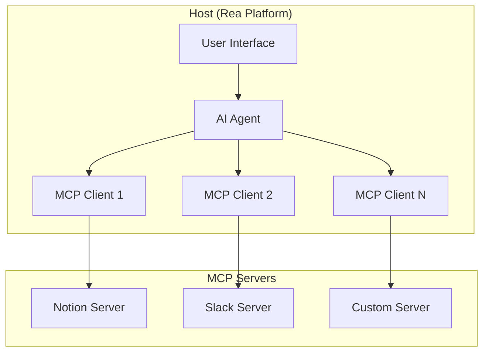
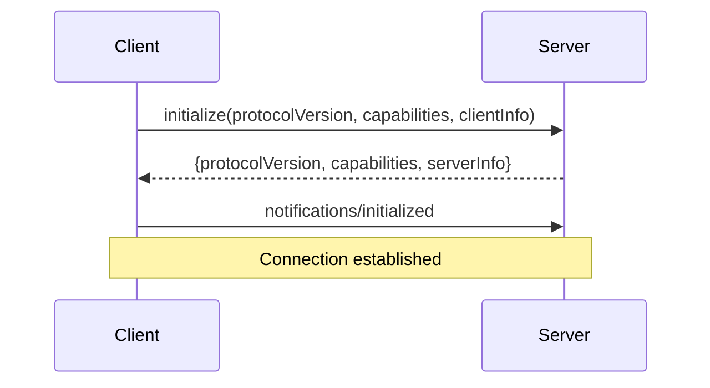
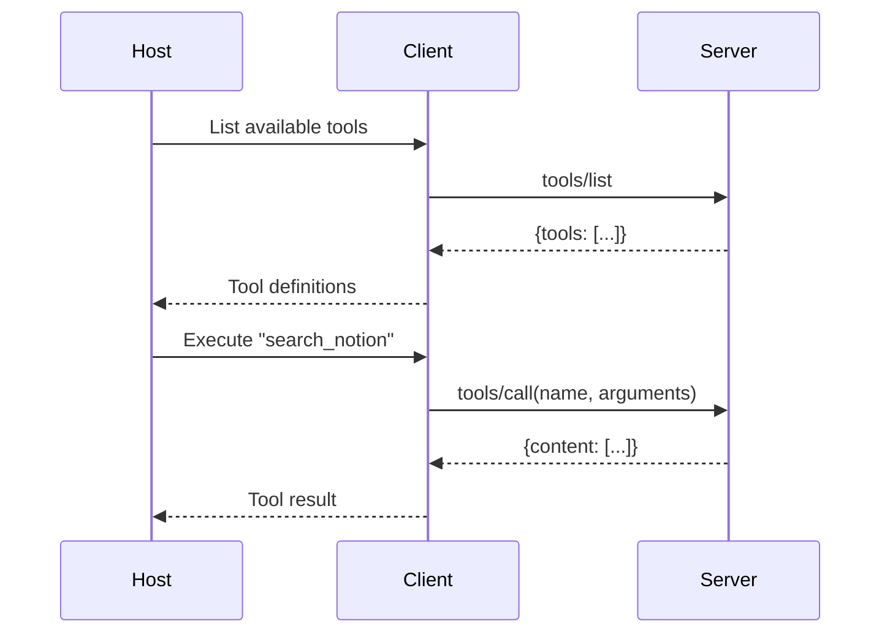
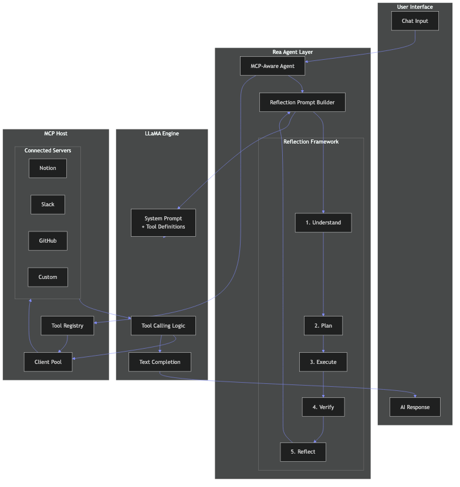
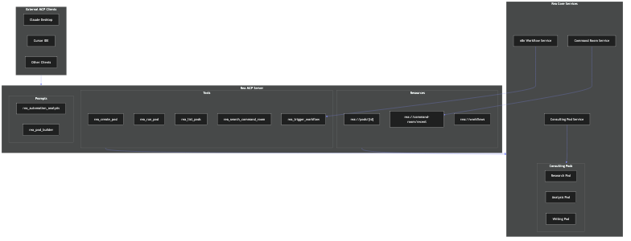
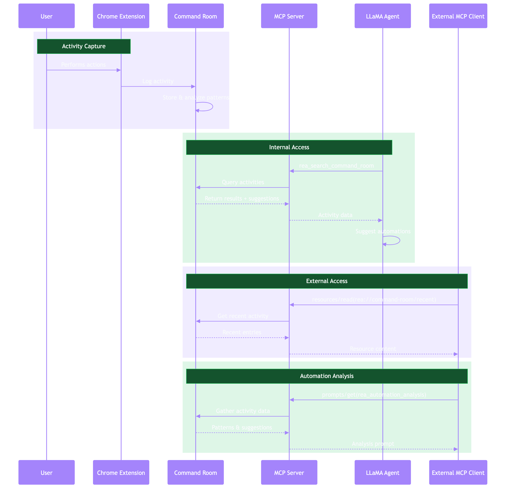
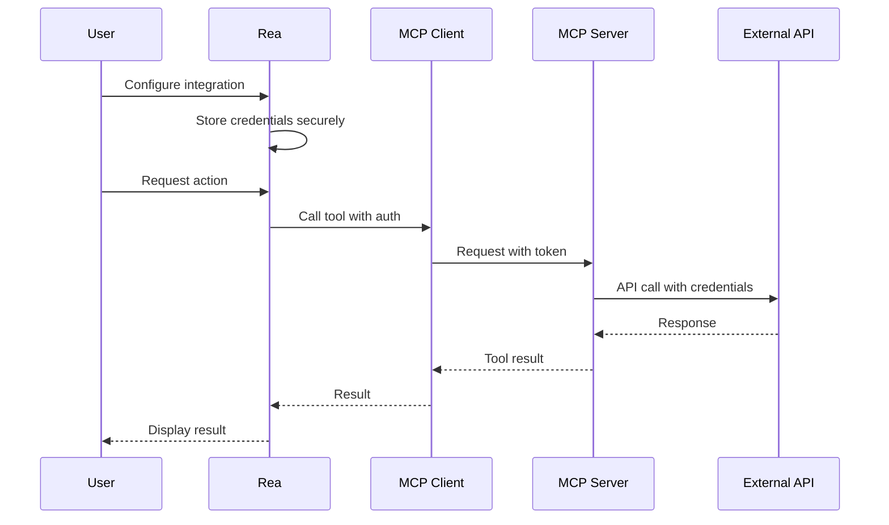

# MCP Architecture Overview

This document provides a detailed technical overview of the Model Context Protocol architecture and how it applies to Rea.

## Core Architecture

MCP follows a client-server architecture with three main participants:



### Component Roles

#### Host (Rea Platform)

The host is the main AI application responsible for:

- Managing the user experience
- Coordinating between AI agents and MCP clients
- Aggregating capabilities from multiple servers
- Enforcing security policies
- Handling user consent for operations

#### MCP Client

Each MCP client maintains a 1:1 connection with an MCP server:

- Establishes and maintains server connection
- Handles protocol negotiation and capability exchange
- Routes requests to the appropriate server
- Manages session state

#### MCP Server

Servers expose capabilities to clients:

- Declares available tools, resources, and prompts
- Executes tool calls and returns results
- Provides resource content on request
- Can run locally (stdio) or remotely (HTTP)

## Protocol Layers

MCP has two distinct layers:

### Data Layer (Protocol)

The inner layer defines the message format and semantics:

```json
{
  "jsonrpc": "2.0",
  "id": 1,
  "method": "tools/call",
  "params": {
    "name": "search_notion",
    "arguments": {
      "query": "meeting notes"
    }
  }
}
```

**Components:**

- JSON-RPC 2.0 message format
- Lifecycle management (initialize, shutdown)
- Capability negotiation
- Request/response patterns
- Notifications

### Transport Layer

The outer layer handles communication:

#### stdio Transport

For local process communication:

```
Client Process ←→ stdin/stdout ←→ Server Process
```

- Server runs as subprocess of client
- Messages sent via standard I/O
- Simple, secure, no network exposure
- Used by Claude Desktop, VS Code, etc.

#### Streamable HTTP Transport

For remote server communication:

```
Client ←→ HTTP POST (requests) ←→ Server
       ←→ SSE (notifications)  ←→
```

- RESTful endpoints for requests
- Server-Sent Events for real-time updates
- Session management via headers
- Supports multiple concurrent clients

## Message Flow

### Initialization Sequence



### Tool Discovery and Execution



## Capability Negotiation

During initialization, both parties declare their capabilities:

### Server Capabilities

```json
{
  "capabilities": {
    "tools": {
      "listChanged": true
    },
    "resources": {
      "subscribe": true,
      "listChanged": true
    },
    "prompts": {
      "listChanged": true
    },
    "logging": {}
  }
}
```

### Client Capabilities

```json
{
  "capabilities": {
    "sampling": {},
    "roots": {
      "listChanged": true
    },
    "elicitation": {}
  }
}
```

## Rea-Specific Architecture

Rea.pro is an **agentic framework and orchestration platform** that uses LLaMA with Reflection prompts for enhanced reasoning. MCP integration extends Rea's capabilities to connect with external services and expose Rea's features to other AI applications.

### LLaMA + MCP Integration



The integration layer bridges LLaMA's tool calling with MCP's standardized protocol:

1. **MCP-Aware Agent** receives user queries and available tools
2. **Reflection Prompt Builder** constructs system prompts with the 5-step framework
3. **LLaMA** processes the prompt, deciding when to call MCP tools
4. **MCP Host** routes tool calls to the appropriate connected servers
5. Results flow back through the agent for final response generation

### Dual MCP Architecture

Rea implements MCP in **two directions**:

```
                    ┌─────────────────────────────────────────────────────────┐
                    │                      REA.PRO                            │
                    │                                                          │
┌─────────────┐     │  ┌──────────────┐           ┌──────────────────────┐   │     ┌──────────────┐
│   Notion    │◄────┼──┤  MCP HOST    │           │    MCP SERVER        │───┼────►│ Claude       │
│   Slack     │     │  │  (Client)    │           │    (Exposes Rea)     │   │     │ Desktop      │
│   GitHub    │     │  │              │           │                      │   │     │              │
│   Custom    │     │  │ Consumes     │           │ Provides:            │   │     │ Cursor       │
└─────────────┘     │  │ external     │           │ - Consulting Pods    │   │     │              │
                    │  │ MCP tools    │           │ - Command Room       │   │     │ Other MCP    │
                    │  └──────┬───────┘           │ - n8n Workflows      │   │     │ Clients      │
                    │         │                   └──────────┬───────────┘   │     └──────────────┘
                    │         │                              │               │
                    │         ▼                              ▼               │
                    │  ┌────────────────────────────────────────────────┐   │
                    │  │              LLaMA + Reflection                 │   │
                    │  │                                                  │   │
                    │  │   System Prompt + Tool Definitions + Context    │   │
                    │  └────────────────────────────────────────────────┘   │
                    └─────────────────────────────────────────────────────────┘
```

### Consulting Pods via MCP



Rea's **Consulting Pods** (multi-agent workflows) are exposed as MCP tools, allowing external clients to:

- Create new consulting pods for complex tasks
- Execute existing pods with custom inputs
- Query pod results and execution history

### Command Room Integration



The **Command Room** captures user activity via browser extension and provides:

- **Resources**: Recent activity data accessible via `rea://command-room/recent`
- **Tools**: `rea_search_command_room` for querying historical activities
- **Prompts**: `rea_automation_analysis` for suggesting automations based on patterns

### Proposed Rea MCP Architecture

```
┌─────────────────────────────────────────────────────────────────────┐
│                       Rea Platform (Laravel)                         │
│                                                                       │
│  ┌─────────────┐    ┌─────────────┐    ┌─────────────────────────┐  │
│  │   API       │───►│   Agent     │───►│  Reflection Prompt      │  │
│  │ Controller  │    │   Service   │    │  Builder                │  │
│  └─────────────┘    └──────┬──────┘    └─────────────────────────┘  │
│                            │                                          │
│                            ▼                                          │
│                   ┌────────────────┐                                  │
│                   │  MCP Manager   │                                  │
│                   │    Service     │                                  │
│                   └───────┬────────┘                                  │
│                           │                                           │
│         ┌─────────────────┼─────────────────┐                        │
│         ▼                 ▼                 ▼                        │
│  ┌────────────┐    ┌────────────┐    ┌────────────┐                 │
│  │ Stdio      │    │ HTTP       │    │ Custom     │                 │
│  │ Client     │    │ Client     │    │ Client     │                 │
│  └─────┬──────┘    └─────┬──────┘    └─────┬──────┘                 │
└────────┼─────────────────┼─────────────────┼────────────────────────┘
         │                 │                 │
         ▼                 ▼                 ▼
  ┌────────────┐    ┌────────────┐    ┌────────────┐
  │ Local      │    │ Remote     │    │ Remote     │
  │ Server     │    │ Server     │    │ Server     │
  │ (stdio)    │    │ (HTTP)     │    │ (HTTP)     │
  └────────────┘    └────────────┘    └────────────┘
```

### Key Components

#### MCP Manager Service

Central service managing all MCP connections:

```php
class MCPManagerService
{
    private array $clients = [];

    public function registerServer(string $name, ServerConfig $config): void
    {
        $client = $this->createClient($config);
        $client->initialize();
        $this->clients[$name] = $client;
    }

    public function getTools(): array
    {
        $tools = [];
        foreach ($this->clients as $name => $client) {
            $serverTools = $client->listTools();
            foreach ($serverTools as $tool) {
                $tools["{$name}.{$tool['name']}"] = $tool;
            }
        }
        return $tools;
    }

    public function callTool(string $fullName, array $arguments): mixed
    {
        [$serverName, $toolName] = explode('.', $fullName, 2);
        return $this->clients[$serverName]->callTool($toolName, $arguments);
    }
}
```

#### Server Configuration

```php
class ServerConfig
{
    public function __construct(
        public string $name,
        public TransportType $transport,
        public ?string $command = null,      // For stdio
        public ?array $args = null,          // For stdio
        public ?string $url = null,          // For HTTP
        public array $env = [],
        public array $headers = [],
    ) {}
}
```

## Security Considerations

### Authentication Flow



### Security Layers

1. **Transport Security**
   - HTTPS for remote servers
   - Process isolation for local servers

2. **Authentication**
   - API tokens stored in Rea's secure storage
   - Passed to servers via environment or headers

3. **Authorization**
   - User consent for sensitive operations
   - Per-server permission configuration
   - Tool-level access control

4. **Input Validation**
   - Schema validation via JSON Schema
   - Sanitization of all inputs

## Performance Considerations

### Connection Pooling

Maintain persistent connections to frequently-used servers:

```php
class ConnectionPool
{
    private array $connections = [];
    private int $maxConnections = 10;

    public function getConnection(string $serverId): MCPClient
    {
        if (!isset($this->connections[$serverId])) {
            $this->connections[$serverId] = $this->createConnection($serverId);
        }
        return $this->connections[$serverId];
    }
}
```

### Caching

Cache tool definitions and resource metadata:

```php
class MCPCache
{
    public function cacheTools(string $serverId, array $tools, int $ttl = 300): void
    {
        Cache::put("mcp.tools.{$serverId}", $tools, $ttl);
    }

    public function getCachedTools(string $serverId): ?array
    {
        return Cache::get("mcp.tools.{$serverId}");
    }
}
```

## Next Steps

- [Quick Start Guide](quickstart.md) - Get started with MCP
- [PHP Client Implementation](../implementation/php-client.md) - Build the MCP client
- [Rea Integration](../implementation/rea-integration.md) - Integrate with Rea

---

!!! note "Architecture Decision Records"
    Major architectural decisions should be documented in ADRs within the Rea codebase.
