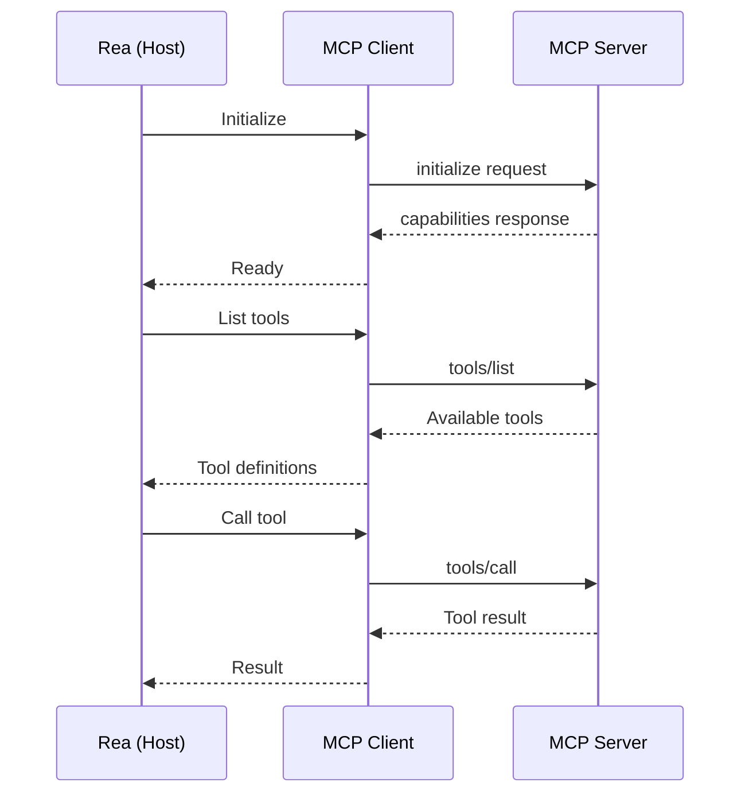

# Introduction to MCP

## What is the Model Context Protocol?

The **Model Context Protocol (MCP)** is an open-source standard developed by Anthropic for connecting AI applications to external systems. It provides a unified way for Large Language Models (LLMs) and AI agents to:

- Access external data sources
- Execute tools and functions
- Use predefined workflows and prompts

## The Problem MCP Solves

Before MCP, every AI integration required custom code:

```
Without MCP:
AI App → Custom Notion Code → Notion API
AI App → Custom Slack Code → Slack API
AI App → Custom Database Code → Database
AI App → Custom GitHub Code → GitHub API
```

This approach has significant drawbacks:

- **Duplication**: Each AI app reimplements the same integrations
- **Inconsistency**: Different apps handle the same APIs differently
- **Maintenance burden**: Updates to APIs require changes everywhere
- **Security risks**: Multiple implementations mean multiple attack surfaces

## The MCP Solution

MCP standardizes the connection layer:

```
With MCP:
AI App → MCP Client → MCP Server (Notion) → Notion API
                   → MCP Server (Slack) → Slack API
                   → MCP Server (Database) → Database
                   → MCP Server (GitHub) → GitHub API
```

Benefits:

- **Write once, use everywhere**: MCP servers work with any MCP-compatible client
- **Consistent interface**: All integrations follow the same patterns
- **Centralized security**: Security handled at the protocol level
- **Growing ecosystem**: Community-built servers for popular services

## Key Concepts

### Three Primitives

MCP defines three core primitives for AI interaction:

| Primitive | Control | Purpose | Example |
|-----------|---------|---------|---------|
| **Tools** | Model-controlled | Execute actions | Search database, send email |
| **Resources** | Application-controlled | Provide context | File contents, API data |
| **Prompts** | User-controlled | Workflow templates | Code review, summarization |

### Communication Model

MCP uses **JSON-RPC 2.0** over two transport types:

1. **stdio** - For local processes (command-line tools)
2. **Streamable HTTP** - For remote servers (web services)



## MCP in the Rea Context

For Rea to support MCP, the platform needs to act as an **MCP Host** with **MCP Client** capabilities:

### Current Rea Architecture

```
User → Rea UI → Rea Backend (Laravel/PHP) → AI Agents → ?
```

### Target Architecture with MCP

```
User → Rea UI → Rea Backend → AI Agents → MCP Client → MCP Servers
                                              ↓
                                         Notion, Slack,
                                         Database, etc.
```

### Implementation Requirements

1. **MCP Client in PHP** - Protocol implementation for connecting to servers
2. **Server Management** - Configuration and lifecycle for multiple MCP servers
3. **Agent Integration** - Exposing MCP tools to Rea's AI agents
4. **Security Layer** - Authentication and authorization for server connections

## What's Next?

Now that you understand what MCP is, proceed to:

- [Architecture Overview](architecture.md) - Detailed technical architecture
- [Quick Start](quickstart.md) - Get MCP running in Rea
- [Notion Tutorial](../tutorials/notion-mcp.md) - Complete working example

---

!!! info "Official Documentation"
    For the complete MCP specification, visit [modelcontextprotocol.io](https://modelcontextprotocol.io)
