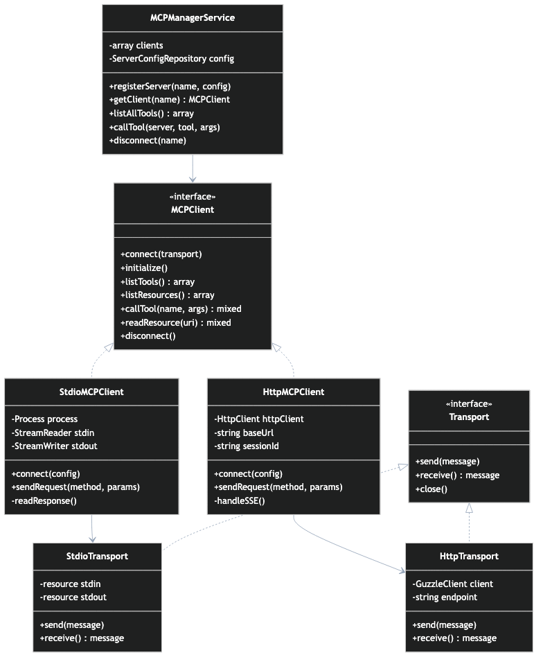

# PHP MCP Client Implementation

This guide covers implementing an MCP client in PHP for integrating with Rea.



## Overview

An MCP client is responsible for:

1. **Connecting** to MCP servers
2. **Initializing** the protocol with capability negotiation
3. **Discovering** available tools, resources, and prompts
4. **Executing** tool calls and resource reads
5. **Managing** the connection lifecycle

## Prerequisites

- PHP 8.1+
- Composer
- Symfony Process component (for stdio)
- Guzzle HTTP client (for HTTP transport)

```bash
composer require symfony/process guzzlehttp/guzzle
```

---

## Client Interface

```php title="app/Contracts/MCPClientInterface.php"
<?php

namespace App\Contracts;

interface MCPClientInterface
{
    /**
     * Connect to the MCP server.
     *
     * @throws ConnectionException
     */
    public function connect(): void;

    /**
     * Check if connected to the server.
     */
    public function isConnected(): bool;

    /**
     * Get server information.
     *
     * @return array{name: string, version: string}
     */
    public function getServerInfo(): array;

    /**
     * Get server capabilities.
     */
    public function getCapabilities(): array;

    /**
     * List available tools.
     *
     * @return array<int, array{
     *     name: string,
     *     description: string,
     *     inputSchema: array
     * }>
     */
    public function listTools(): array;

    /**
     * Call a tool.
     *
     * @param string $name Tool name
     * @param array $arguments Tool arguments
     * @return array{content: array, isError?: bool}
     * @throws ToolExecutionException
     */
    public function callTool(string $name, array $arguments = []): array;

    /**
     * List available resources.
     *
     * @return array<int, array{
     *     uri: string,
     *     name: string,
     *     mimeType?: string
     * }>
     */
    public function listResources(): array;

    /**
     * Read a resource.
     *
     * @param string $uri Resource URI
     * @return array{uri: string, mimeType: string, text?: string, blob?: string}
     */
    public function readResource(string $uri): array;

    /**
     * List available prompts.
     *
     * @return array<int, array{
     *     name: string,
     *     description?: string,
     *     arguments?: array
     * }>
     */
    public function listPrompts(): array;

    /**
     * Get a prompt.
     *
     * @param string $name Prompt name
     * @param array $arguments Prompt arguments
     * @return array{description?: string, messages: array}
     */
    public function getPrompt(string $name, array $arguments = []): array;

    /**
     * Disconnect from the server.
     */
    public function disconnect(): void;
}
```

---

## Base Client Implementation

```php title="app/Services/MCP/BaseMCPClient.php"
<?php

namespace App\Services\MCP;

use App\Contracts\MCPClientInterface;
use App\Exceptions\MCPException;
use Illuminate\Support\Facades\Log;

abstract class BaseMCPClient implements MCPClientInterface
{
    protected bool $connected = false;
    protected array $serverInfo = [];
    protected array $capabilities = [];
    protected int $requestId = 0;

    protected array $config;

    public function __construct(array $config)
    {
        $this->config = $config;
    }

    public function connect(): void
    {
        $this->doConnect();

        // Send initialize request
        $response = $this->sendRequest('initialize', [
            'protocolVersion' => '2024-11-05',
            'capabilities' => $this->getClientCapabilities(),
            'clientInfo' => [
                'name' => 'rea-mcp-client',
                'version' => config('app.version', '1.0.0'),
            ],
        ]);

        $this->serverInfo = $response['serverInfo'] ?? [];
        $this->capabilities = $response['capabilities'] ?? [];

        // Send initialized notification
        $this->sendNotification('notifications/initialized');

        $this->connected = true;

        Log::info('MCP client connected', [
            'server' => $this->serverInfo,
            'capabilities' => $this->capabilities,
        ]);
    }

    public function isConnected(): bool
    {
        return $this->connected;
    }

    public function getServerInfo(): array
    {
        return $this->serverInfo;
    }

    public function getCapabilities(): array
    {
        return $this->capabilities;
    }

    public function listTools(): array
    {
        $this->ensureConnected();

        $response = $this->sendRequest('tools/list');
        return $response['tools'] ?? [];
    }

    public function callTool(string $name, array $arguments = []): array
    {
        $this->ensureConnected();

        Log::debug('Calling MCP tool', [
            'tool' => $name,
            'arguments' => $arguments,
        ]);

        $response = $this->sendRequest('tools/call', [
            'name' => $name,
            'arguments' => $arguments,
        ]);

        if (isset($response['isError']) && $response['isError']) {
            Log::warning('MCP tool returned error', [
                'tool' => $name,
                'error' => $response['content'],
            ]);
        }

        return $response;
    }

    public function listResources(): array
    {
        $this->ensureConnected();

        if (!$this->hasCapability('resources')) {
            return [];
        }

        $response = $this->sendRequest('resources/list');
        return $response['resources'] ?? [];
    }

    public function readResource(string $uri): array
    {
        $this->ensureConnected();

        $response = $this->sendRequest('resources/read', [
            'uri' => $uri,
        ]);

        return $response['contents'][0] ?? [];
    }

    public function listPrompts(): array
    {
        $this->ensureConnected();

        if (!$this->hasCapability('prompts')) {
            return [];
        }

        $response = $this->sendRequest('prompts/list');
        return $response['prompts'] ?? [];
    }

    public function getPrompt(string $name, array $arguments = []): array
    {
        $this->ensureConnected();

        return $this->sendRequest('prompts/get', [
            'name' => $name,
            'arguments' => $arguments,
        ]);
    }

    public function disconnect(): void
    {
        if ($this->connected) {
            $this->doDisconnect();
            $this->connected = false;
            Log::info('MCP client disconnected');
        }
    }

    // Abstract methods for transport-specific implementation
    abstract protected function doConnect(): void;
    abstract protected function doDisconnect(): void;
    abstract protected function sendMessage(array $message): void;
    abstract protected function receiveMessage(int $expectedId): array;

    protected function sendRequest(string $method, array $params = []): array
    {
        $id = ++$this->requestId;

        $request = [
            'jsonrpc' => '2.0',
            'id' => $id,
            'method' => $method,
        ];

        if (!empty($params)) {
            $request['params'] = $params;
        }

        $this->sendMessage($request);

        $response = $this->receiveMessage($id);

        if (isset($response['error'])) {
            throw new MCPException(
                $response['error']['message'],
                $response['error']['code'] ?? 0
            );
        }

        return $response['result'] ?? [];
    }

    protected function sendNotification(string $method, array $params = []): void
    {
        $notification = [
            'jsonrpc' => '2.0',
            'method' => $method,
        ];

        if (!empty($params)) {
            $notification['params'] = $params;
        }

        $this->sendMessage($notification);
    }

    protected function getClientCapabilities(): array
    {
        return [
            'roots' => [
                'listChanged' => true,
            ],
        ];
    }

    protected function hasCapability(string $capability): bool
    {
        return isset($this->capabilities[$capability]);
    }

    protected function ensureConnected(): void
    {
        if (!$this->connected) {
            throw new MCPException('Not connected to MCP server');
        }
    }
}
```

---

## stdio Client Implementation

```php title="app/Services/MCP/StdioMCPClient.php"
<?php

namespace App\Services\MCP;

use App\Exceptions\MCPException;
use Symfony\Component\Process\Process;

class StdioMCPClient extends BaseMCPClient
{
    private ?Process $process = null;
    private $inputStream = null;
    private string $outputBuffer = '';

    protected function doConnect(): void
    {
        $command = array_merge(
            [$this->config['command']],
            $this->config['args'] ?? []
        );

        $env = array_merge(
            getenv(),
            $this->config['env'] ?? []
        );

        $this->process = new Process($command, null, $env);
        $this->process->setTimeout(null);

        // Use pipes for bidirectional communication
        $this->process->setInput(STDIN);

        $descriptors = [
            0 => ['pipe', 'r'], // stdin
            1 => ['pipe', 'w'], // stdout
            2 => ['pipe', 'w'], // stderr
        ];

        $this->process->start(function ($type, $buffer) {
            if ($type === Process::ERR) {
                // Log stderr output
                error_log("MCP stderr: {$buffer}");
            }
        });

        // Get the input stream
        $pipes = $this->process->getPipes();
        $this->inputStream = $pipes[0];

        // Wait for process to be ready
        usleep(500000); // 500ms

        if (!$this->process->isRunning()) {
            $error = $this->process->getErrorOutput();
            throw new MCPException("Failed to start MCP server: {$error}");
        }
    }

    protected function doDisconnect(): void
    {
        if ($this->inputStream !== null) {
            fclose($this->inputStream);
            $this->inputStream = null;
        }

        if ($this->process !== null) {
            $this->process->stop(3);
            $this->process = null;
        }

        $this->outputBuffer = '';
    }

    protected function sendMessage(array $message): void
    {
        if ($this->inputStream === null) {
            throw new MCPException('Not connected');
        }

        $json = json_encode($message, JSON_UNESCAPED_SLASHES);
        fwrite($this->inputStream, $json . "\n");
        fflush($this->inputStream);
    }

    protected function receiveMessage(int $expectedId): array
    {
        $timeout = $this->config['timeout'] ?? 30;
        $startTime = time();

        while (time() - $startTime < $timeout) {
            // Read from process output
            $output = $this->process->getIncrementalOutput();

            if (!empty($output)) {
                $this->outputBuffer .= $output;
            }

            // Try to parse complete messages
            while (($pos = strpos($this->outputBuffer, "\n")) !== false) {
                $line = substr($this->outputBuffer, 0, $pos);
                $this->outputBuffer = substr($this->outputBuffer, $pos + 1);

                if (empty(trim($line))) {
                    continue;
                }

                $message = json_decode($line, true);

                if (json_last_error() !== JSON_ERROR_NONE) {
                    continue;
                }

                // Check if this is the response we're waiting for
                if (isset($message['id']) && $message['id'] === $expectedId) {
                    return $message;
                }

                // Handle notifications
                if (!isset($message['id']) && isset($message['method'])) {
                    $this->handleNotification($message);
                }
            }

            usleep(10000); // 10ms
        }

        throw new MCPException('Request timeout');
    }

    protected function handleNotification(array $notification): void
    {
        $method = $notification['method'] ?? '';

        switch ($method) {
            case 'notifications/tools/list_changed':
                // Invalidate tools cache
                event('mcp.tools.changed');
                break;

            case 'notifications/resources/list_changed':
                // Invalidate resources cache
                event('mcp.resources.changed');
                break;

            default:
                // Log unknown notification
                Log::debug('Unknown MCP notification', [
                    'method' => $method,
                ]);
        }
    }
}
```

---

## HTTP Client Implementation

```php title="app/Services/MCP/HttpMCPClient.php"
<?php

namespace App\Services\MCP;

use App\Exceptions\MCPException;
use GuzzleHttp\Client;
use GuzzleHttp\Exception\RequestException;

class HttpMCPClient extends BaseMCPClient
{
    private Client $httpClient;
    private ?string $sessionId = null;

    protected function doConnect(): void
    {
        $this->httpClient = new Client([
            'base_uri' => $this->config['url'],
            'timeout' => $this->config['timeout'] ?? 30,
            'headers' => $this->config['headers'] ?? [],
        ]);
    }

    protected function doDisconnect(): void
    {
        if ($this->sessionId !== null) {
            try {
                $this->httpClient->delete('/mcp', [
                    'headers' => [
                        'Mcp-Session-Id' => $this->sessionId,
                    ],
                ]);
            } catch (\Exception $e) {
                // Ignore disconnect errors
            }

            $this->sessionId = null;
        }
    }

    protected function sendMessage(array $message): void
    {
        // For HTTP, we don't send messages separately
        // They're sent as part of sendRequest
    }

    protected function receiveMessage(int $expectedId): array
    {
        // For HTTP, receiving is handled in sendRequest
        throw new MCPException('Direct receive not supported for HTTP transport');
    }

    protected function sendRequest(string $method, array $params = []): array
    {
        $id = ++$this->requestId;

        $request = [
            'jsonrpc' => '2.0',
            'id' => $id,
            'method' => $method,
        ];

        if (!empty($params)) {
            $request['params'] = $params;
        }

        try {
            $headers = [
                'Content-Type' => 'application/json',
            ];

            if ($this->sessionId !== null) {
                $headers['Mcp-Session-Id'] = $this->sessionId;
            }

            $response = $this->httpClient->post('/mcp', [
                'headers' => $headers,
                'json' => $request,
            ]);

            // Extract session ID from initialize response
            if ($method === 'initialize') {
                $sessionHeader = $response->getHeader('Mcp-Session-Id');
                if (!empty($sessionHeader)) {
                    $this->sessionId = $sessionHeader[0];
                }
            }

            $body = json_decode($response->getBody()->getContents(), true);

            if (isset($body['error'])) {
                throw new MCPException(
                    $body['error']['message'],
                    $body['error']['code'] ?? 0
                );
            }

            return $body['result'] ?? [];

        } catch (RequestException $e) {
            $statusCode = $e->hasResponse()
                ? $e->getResponse()->getStatusCode()
                : 0;

            throw new MCPException(
                "HTTP request failed: {$e->getMessage()}",
                $statusCode
            );
        }
    }

    protected function sendNotification(string $method, array $params = []): void
    {
        $notification = [
            'jsonrpc' => '2.0',
            'method' => $method,
        ];

        if (!empty($params)) {
            $notification['params'] = $params;
        }

        try {
            $headers = [
                'Content-Type' => 'application/json',
            ];

            if ($this->sessionId !== null) {
                $headers['Mcp-Session-Id'] = $this->sessionId;
            }

            $this->httpClient->post('/mcp', [
                'headers' => $headers,
                'json' => $notification,
            ]);
        } catch (\Exception $e) {
            // Notifications don't require responses
            Log::warning('Failed to send MCP notification', [
                'method' => $method,
                'error' => $e->getMessage(),
            ]);
        }
    }
}
```

---

## Client Factory

```php title="app/Services/MCP/MCPClientFactory.php"
<?php

namespace App\Services\MCP;

use App\Contracts\MCPClientInterface;
use InvalidArgumentException;

class MCPClientFactory
{
    public static function create(array $config): MCPClientInterface
    {
        $transport = $config['transport'] ?? 'stdio';

        return match ($transport) {
            'stdio' => new StdioMCPClient($config),
            'http' => new HttpMCPClient($config),
            default => throw new InvalidArgumentException(
                "Unknown transport: {$transport}"
            ),
        };
    }
}
```

---

## Usage Example

```php
<?php

use App\Services\MCP\MCPClientFactory;

// Create client from config
$config = [
    'transport' => 'stdio',
    'command' => 'npx',
    'args' => ['-y', '@notionhq/notion-mcp-server'],
    'env' => [
        'NOTION_TOKEN' => env('NOTION_TOKEN'),
    ],
];

$client = MCPClientFactory::create($config);

try {
    // Connect
    $client->connect();
    echo "Connected to: " . $client->getServerInfo()['name'] . "\n";

    // List tools
    $tools = $client->listTools();
    echo "Available tools:\n";
    foreach ($tools as $tool) {
        echo "  - {$tool['name']}: {$tool['description']}\n";
    }

    // Call a tool
    $result = $client->callTool('search', [
        'query' => 'meeting notes',
    ]);

    echo "Search results:\n";
    print_r($result);

} finally {
    $client->disconnect();
}
```

---

## Next Steps

- [PHP MCP Server](php-server.md) - Build your own MCP server
- [Rea Integration](rea-integration.md) - Integrate with Rea platform
- [Security](../reference/security.md) - Secure your implementation
