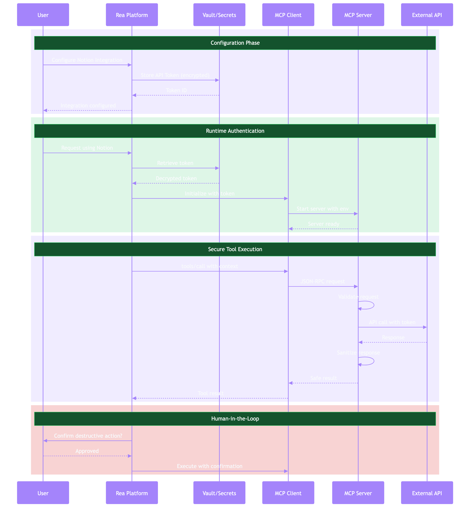

# Security Reference

Security best practices for MCP integration in Rea.



## Overview

MCP security operates at multiple layers:

| Layer | Concerns |
|-------|----------|
| **Transport** | Encryption, authentication |
| **Protocol** | Message validation, capability negotiation |
| **Application** | Authorization, audit logging |
| **Data** | Credential storage, input sanitization |

---

## Transport Security

### stdio Transport

For local servers running via stdio:

- **Process isolation**: Server runs with same privileges as client
- **No network exposure**: Communication via pipes only
- **Trust boundary**: Trust is implicit (same machine)

**Best Practices:**

```php
// Never echo to stdout in stdio servers (breaks protocol)
ini_set('display_errors', '0');
ini_set('log_errors', '1');
ini_set('error_log', 'php://stderr');
```

### HTTP Transport

For remote servers:

**Required:**

- HTTPS in production (TLS 1.2+)
- Authentication tokens
- Origin validation

```php
// Validate Origin header to prevent DNS rebinding
$origin = $request->getHeader('Origin')[0] ?? '';
$allowed = config('mcp.allowed_origins', []);

if (!empty($origin) && !in_array($origin, $allowed)) {
    return response()->json(['error' => 'Forbidden'], 403);
}
```

**Bind to localhost for local HTTP servers:**

```php
$transport = new StreamableHttpTransport(
    host: '127.0.0.1', // Not 0.0.0.0
    port: 8080
);
```

---

## Authentication

### Token Management

**Storage:**

```php
// Use Laravel's encryption for API tokens
protected $casts = [
    'credentials' => AsEncryptedCollection::class,
];
```

**Rotation:**

```php
// Implement token rotation
class TokenRotationService
{
    public function rotateToken(MCPConnection $connection): void
    {
        $newToken = $this->generateToken();

        $connection->update([
            'credentials' => array_merge(
                $connection->credentials->toArray(),
                ['token' => $newToken]
            ),
        ]);

        // Invalidate old sessions
        Cache::forget("mcp_session_{$connection->id}");
    }
}
```

### OAuth 2.1 for HTTP Servers

```php
// OAuth authorization code flow with PKCE
class MCPOAuthController extends Controller
{
    public function authorize(Request $request)
    {
        $validated = $request->validate([
            'client_id' => 'required|string',
            'redirect_uri' => 'required|url',
            'code_challenge' => 'required|string',
            'code_challenge_method' => 'required|in:S256',
            'state' => 'required|string',
        ]);

        // Verify client and redirect URI
        $client = OAuthClient::where('client_id', $validated['client_id'])
            ->where('redirect_uri', $validated['redirect_uri'])
            ->firstOrFail();

        // Generate authorization code
        $code = AuthorizationCode::create([
            'client_id' => $client->id,
            'user_id' => auth()->id(),
            'code' => Str::random(64),
            'code_challenge' => $validated['code_challenge'],
            'expires_at' => now()->addMinutes(10),
        ]);

        return redirect($validated['redirect_uri'] . '?' . http_build_query([
            'code' => $code->code,
            'state' => $validated['state'],
        ]));
    }

    public function token(Request $request)
    {
        $validated = $request->validate([
            'grant_type' => 'required|in:authorization_code',
            'code' => 'required|string',
            'client_id' => 'required|string',
            'code_verifier' => 'required|string',
        ]);

        $authCode = AuthorizationCode::where('code', $validated['code'])
            ->where('expires_at', '>', now())
            ->firstOrFail();

        // Verify PKCE
        $challenge = base64_encode(hash('sha256', $validated['code_verifier'], true));
        if (!hash_equals($authCode->code_challenge, $challenge)) {
            abort(400, 'Invalid code verifier');
        }

        // Generate access token
        $accessToken = AccessToken::create([
            'user_id' => $authCode->user_id,
            'client_id' => $authCode->client_id,
            'token' => Str::random(64),
            'expires_at' => now()->addHour(),
        ]);

        $authCode->delete();

        return response()->json([
            'access_token' => $accessToken->token,
            'token_type' => 'Bearer',
            'expires_in' => 3600,
        ]);
    }
}
```

---

## Authorization

### Permission Model

Define granular permissions for MCP operations:

```php
// Permission constants
class MCPPermission
{
    const READ_TOOLS = 'mcp.tools.read';
    const EXECUTE_TOOLS = 'mcp.tools.execute';
    const READ_RESOURCES = 'mcp.resources.read';
    const MANAGE_CONNECTIONS = 'mcp.connections.manage';
}

// Policy
class MCPConnectionPolicy
{
    public function view(User $user, MCPConnection $connection): bool
    {
        return $user->id === $connection->user_id;
    }

    public function executeTool(User $user, MCPConnection $connection, string $tool): bool
    {
        // Check user has execute permission
        if (!$user->can(MCPPermission::EXECUTE_TOOLS)) {
            return false;
        }

        // Check connection belongs to user
        if ($user->id !== $connection->user_id) {
            return false;
        }

        // Check tool is not blacklisted
        $blacklist = config('mcp.tool_blacklist', []);
        if (in_array($tool, $blacklist)) {
            return false;
        }

        return true;
    }
}
```

### Human-in-the-Loop

Require explicit approval for sensitive operations:

```php
class ToolApprovalService
{
    private array $requiresApproval = [
        'delete',
        'archive',
        'update',
        'create',
        'send_message',
    ];

    public function needsApproval(string $toolName): bool
    {
        foreach ($this->requiresApproval as $keyword) {
            if (str_contains(strtolower($toolName), $keyword)) {
                return true;
            }
        }

        return false;
    }

    public function requestApproval(User $user, string $tool, array $args): ToolApproval
    {
        return ToolApproval::create([
            'user_id' => $user->id,
            'tool' => $tool,
            'arguments' => $args,
            'status' => 'pending',
            'expires_at' => now()->addMinutes(5),
        ]);
    }

    public function approve(ToolApproval $approval, User $user): void
    {
        if ($approval->user_id !== $user->id) {
            throw new UnauthorizedException();
        }

        if ($approval->expires_at < now()) {
            throw new ExpiredException();
        }

        $approval->update([
            'status' => 'approved',
            'approved_at' => now(),
        ]);
    }
}
```

---

## Input Validation

### JSON Schema Validation

```php
use Opis\JsonSchema\Validator;
use Opis\JsonSchema\Errors\ErrorFormatter;

class ToolInputValidator
{
    public function validate(array $tool, array $arguments): void
    {
        $schema = $tool['inputSchema'];

        $validator = new Validator();
        $result = $validator->validate(
            json_decode(json_encode($arguments)),
            json_encode($schema)
        );

        if (!$result->isValid()) {
            $formatter = new ErrorFormatter();
            $errors = $formatter->format($result->error());

            throw new ValidationException(
                'Invalid tool arguments: ' . json_encode($errors)
            );
        }
    }
}
```

### Input Sanitization

```php
class InputSanitizer
{
    public function sanitize(array $arguments, array $schema): array
    {
        $sanitized = [];

        foreach ($arguments as $key => $value) {
            $propSchema = $schema['properties'][$key] ?? null;

            if ($propSchema === null) {
                continue; // Skip unknown properties
            }

            $sanitized[$key] = $this->sanitizeValue($value, $propSchema);
        }

        return $sanitized;
    }

    private function sanitizeValue(mixed $value, array $schema): mixed
    {
        return match ($schema['type'] ?? 'string') {
            'string' => $this->sanitizeString($value),
            'integer' => (int) $value,
            'number' => (float) $value,
            'boolean' => (bool) $value,
            'array' => array_map(
                fn($v) => $this->sanitizeValue($v, $schema['items'] ?? []),
                (array) $value
            ),
            'object' => $this->sanitize((array) $value, $schema),
            default => $value,
        };
    }

    private function sanitizeString(string $value): string
    {
        // Remove null bytes
        $value = str_replace("\0", '', $value);

        // Limit length
        if (strlen($value) > 10000) {
            $value = substr($value, 0, 10000);
        }

        return $value;
    }
}
```

### SQL Injection Prevention

```php
#[McpTool(name: 'query_database')]
public function queryDatabase(string $table, array $filters): array
{
    // Whitelist allowed tables
    $allowedTables = ['users', 'posts', 'comments'];
    if (!in_array($table, $allowedTables)) {
        throw new InvalidArgumentException("Invalid table: {$table}");
    }

    // Use parameterized queries
    $query = DB::table($table);

    foreach ($filters as $column => $value) {
        // Validate column names
        if (!preg_match('/^[a-z_]+$/', $column)) {
            throw new InvalidArgumentException("Invalid column: {$column}");
        }

        $query->where($column, '=', $value);
    }

    return $query->limit(100)->get()->toArray();
}
```

---

## Audit Logging

### Structured Logging

```php
class MCPAuditLogger
{
    public function logToolCall(
        User $user,
        string $tool,
        array $arguments,
        mixed $result,
        float $duration
    ): void {
        Log::channel('mcp_audit')->info('Tool execution', [
            'event' => 'tool_call',
            'user_id' => $user->id,
            'user_email' => $user->email,
            'tool' => $tool,
            'arguments' => $this->redactSensitive($arguments),
            'result_type' => gettype($result),
            'is_error' => $result['isError'] ?? false,
            'duration_ms' => round($duration * 1000),
            'ip_address' => request()->ip(),
            'user_agent' => request()->userAgent(),
            'timestamp' => now()->toIso8601String(),
        ]);
    }

    public function logConnectionEvent(
        User $user,
        MCPConnection $connection,
        string $event
    ): void {
        Log::channel('mcp_audit')->info('Connection event', [
            'event' => $event,
            'user_id' => $user->id,
            'connection_id' => $connection->id,
            'connection_name' => $connection->name,
            'server_type' => $connection->server_type,
            'timestamp' => now()->toIso8601String(),
        ]);
    }

    private function redactSensitive(array $data): array
    {
        $sensitive = ['password', 'token', 'secret', 'key', 'credential'];

        return collect($data)->map(function ($value, $key) use ($sensitive) {
            foreach ($sensitive as $pattern) {
                if (str_contains(strtolower($key), $pattern)) {
                    return '[REDACTED]';
                }
            }
            return $value;
        })->toArray();
    }
}
```

### Log Retention

```php
// config/logging.php
'channels' => [
    'mcp_audit' => [
        'driver' => 'daily',
        'path' => storage_path('logs/mcp-audit.log'),
        'level' => 'info',
        'days' => 90, // Retain for 90 days
    ],
],
```

---

## Rate Limiting

```php
// App\Providers\RouteServiceProvider

RateLimiter::for('mcp_tools', function (Request $request) {
    return [
        // Per-user limit
        Limit::perMinute(60)->by($request->user()?->id),

        // Per-tool limit (prevent abuse of expensive tools)
        Limit::perMinute(10)->by(
            $request->user()?->id . ':' . $request->input('tool')
        ),
    ];
});

// Middleware
Route::middleware(['auth:sanctum', 'throttle:mcp_tools'])
    ->post('/mcp/tools/call', [MCPToolController::class, 'call']);
```

---

## Security Checklist

### Before Production

- [ ] HTTPS enabled for all HTTP transport servers
- [ ] API tokens stored encrypted in database
- [ ] Input validation on all tool arguments
- [ ] Rate limiting configured
- [ ] Audit logging enabled
- [ ] Sensitive operations require approval
- [ ] Origin validation for HTTP servers
- [ ] Error messages don't leak sensitive info
- [ ] Dependencies up to date

### Ongoing

- [ ] Regular security audits
- [ ] Monitor audit logs for anomalies
- [ ] Rotate API tokens periodically
- [ ] Review tool permissions
- [ ] Update MCP SDK versions
- [ ] Test disaster recovery

---

## Common Vulnerabilities

### 1. Command Injection

**Vulnerable:**
```php
#[McpTool(name: 'run_command')]
public function runCommand(string $command): string
{
    return shell_exec($command); // DANGEROUS!
}
```

**Safe:**
```php
#[McpTool(name: 'list_files')]
public function listFiles(string $directory): array
{
    // Validate path
    $realPath = realpath($directory);
    $allowedBase = realpath('/var/data');

    if (!$realPath || !str_starts_with($realPath, $allowedBase)) {
        throw new InvalidArgumentException('Invalid directory');
    }

    return scandir($realPath);
}
```

### 2. Path Traversal

**Vulnerable:**
```php
public function readFile(string $filename): string
{
    return file_get_contents("/data/{$filename}"); // DANGEROUS!
}
```

**Safe:**
```php
public function readFile(string $filename): string
{
    // Remove path components
    $filename = basename($filename);

    // Validate extension
    $allowed = ['txt', 'json', 'md'];
    $ext = pathinfo($filename, PATHINFO_EXTENSION);

    if (!in_array($ext, $allowed)) {
        throw new InvalidArgumentException('Invalid file type');
    }

    $path = "/data/{$filename}";

    if (!file_exists($path)) {
        throw new NotFoundException('File not found');
    }

    return file_get_contents($path);
}
```

### 3. Credential Exposure

**Vulnerable:**
```php
public function handleError(\Exception $e): array
{
    return ['error' => $e->getMessage()]; // May leak credentials
}
```

**Safe:**
```php
public function handleError(\Exception $e): array
{
    Log::error('MCP error', ['exception' => $e]);

    return [
        'error' => 'An error occurred',
        'code' => $e->getCode(),
    ];
}
```

---

## Next Steps

- [API Reference](api.md) - Complete API documentation
- [Configuration](configuration.md) - Configuration options
- [Rea Integration](../implementation/rea-integration.md) - Implementation guide
