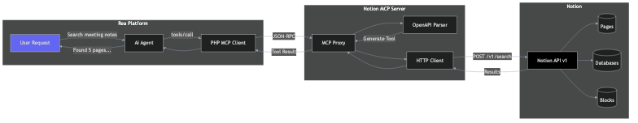
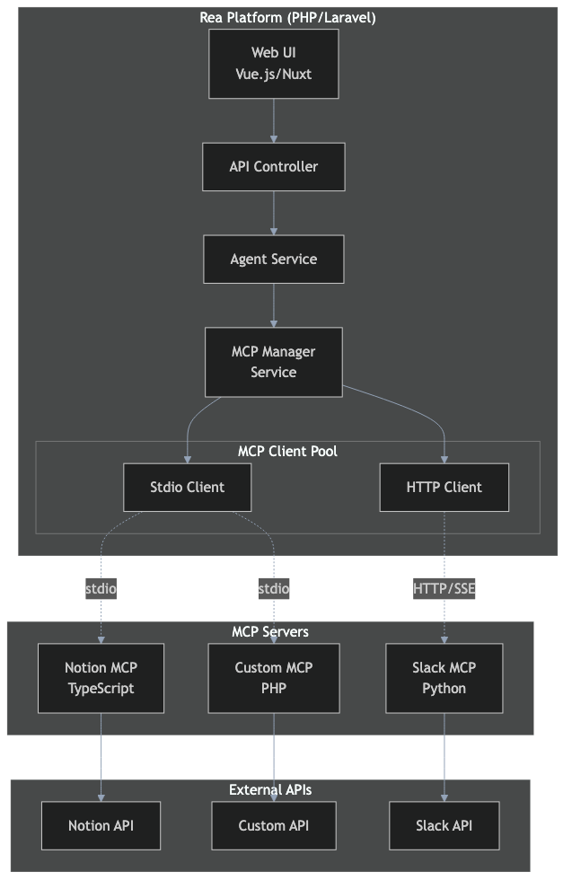
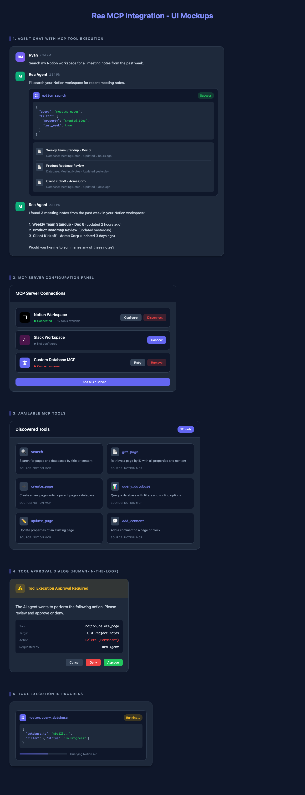

# Notion MCP Integration Tutorial

This comprehensive tutorial walks you through integrating Notion with Rea using the Model Context Protocol (MCP). By the end, your Rea AI agents will be able to search, read, create, and update Notion content.



## What You'll Build

A complete integration that allows Rea agents to:

- **Search** your Notion workspace for pages and databases
- **Read** page content and database entries
- **Create** new pages and database items
- **Update** existing content
- **Comment** on pages

## Prerequisites

Before starting, ensure you have:

- [ ] Rea platform (v1.15+) with PHP 8.1+
- [ ] Composer installed
- [ ] Node.js 18+ (for running the Notion MCP server)
- [ ] A Notion account with a workspace
- [ ] Admin access to create integrations

## Architecture Overview



The integration consists of three components:

| Component | Technology | Role |
|-----------|------------|------|
| Rea Platform | PHP/Laravel | MCP Host & Client |
| Notion MCP Server | Node.js/TypeScript | MCP Server |
| Notion API | REST API | Data source |

---

## Step 1: Create a Notion Integration

### 1.1 Navigate to Integrations

1. Go to [notion.so/my-integrations](https://www.notion.so/my-integrations)
2. Click **"+ New integration"**

### 1.2 Configure Integration

Fill in the integration details:

| Field | Value |
|-------|-------|
| **Name** | `Rea MCP Integration` |
| **Associated workspace** | Select your workspace |
| **Logo** | (Optional) Upload a logo |

### 1.3 Set Capabilities

Enable the following capabilities:

=== "Read Content"
    Required for searching and reading pages/databases.

=== "Update Content"
    Required for modifying existing pages.

=== "Insert Content"
    Required for creating new pages and blocks.

=== "Read Comments"
    Required for reading page comments.

=== "Create Comments"
    Required for adding comments to pages.

!!! tip "Principle of Least Privilege"
    Only enable capabilities your agents actually need. For read-only use cases, disable Update, Insert, and Create Comments.

### 1.4 Copy the Token

After clicking **Submit**, you'll see your **Internal Integration Token**:

```
ntn_xxxxxxxxxxxxxxxxxxxxxxxxxxxxxxxxxxxxxxxxxxxxx
```

!!! danger "Keep This Secret"
    Never commit this token to version control or share it publicly.

---

## Step 2: Grant Notion Access

The integration needs explicit access to each page/database.

### Option A: Via Page Menu

1. Open a Notion page you want to access
2. Click **"..."** (top-right menu)
3. Select **"Add connections"**
4. Find and select **"Rea MCP Integration"**

### Option B: Via Database

1. Open a Notion database
2. Click **"..."** → **"Add connections"**
3. Select your integration

!!! info "Access Inheritance"
    Granting access to a parent page automatically grants access to all child pages.

---

## Step 3: Install PHP MCP SDK

Add the MCP SDK to your Rea installation:

```bash
cd /path/to/rea
composer require mcp/sdk
```

!!! note "SDK Status"
    The PHP MCP SDK is in active development. Check [github.com/modelcontextprotocol/php-sdk](https://github.com/modelcontextprotocol/php-sdk) for the latest version.

---

## Step 4: Configure the MCP Server

### 4.1 Create Configuration File

Create `config/mcp.php`:

```php title="config/mcp.php"
<?php

return [
    /*
    |--------------------------------------------------------------------------
    | MCP Servers Configuration
    |--------------------------------------------------------------------------
    |
    | Define your MCP server connections here. Each server can use either
    | 'stdio' transport (local process) or 'http' transport (remote server).
    |
    */

    'servers' => [
        'notion' => [
            // Transport type: 'stdio' for local, 'http' for remote
            'transport' => 'stdio',

            // Command to start the server (stdio only)
            'command' => 'npx',
            'args' => ['-y', '@notionhq/notion-mcp-server'],

            // Environment variables
            'env' => [
                'NOTION_TOKEN' => env('NOTION_TOKEN'),
            ],

            // Connection timeout in seconds
            'timeout' => 30,

            // Auto-reconnect on failure
            'reconnect' => true,
            'reconnect_delay' => 5,
        ],
    ],

    /*
    |--------------------------------------------------------------------------
    | Tool Caching
    |--------------------------------------------------------------------------
    |
    | Cache discovered tools to improve performance.
    |
    */

    'cache' => [
        'enabled' => true,
        'ttl' => 300, // 5 minutes
        'prefix' => 'mcp_',
    ],

    /*
    |--------------------------------------------------------------------------
    | Security Settings
    |--------------------------------------------------------------------------
    */

    'security' => [
        // Require approval for destructive operations
        'require_approval' => ['delete', 'archive'],

        // Log all tool executions
        'audit_logging' => true,
    ],
];
```

### 4.2 Set Environment Variable

Add your Notion token to `.env`:

```bash title=".env"
NOTION_TOKEN=ntn_your_token_here
```

---

## Step 5: Create the MCP Service

### 5.1 MCP Client Interface

```php title="app/Contracts/MCPClientInterface.php"
<?php

namespace App\Contracts;

interface MCPClientInterface
{
    /**
     * Connect to the MCP server.
     */
    public function connect(): void;

    /**
     * Check if connected.
     */
    public function isConnected(): bool;

    /**
     * List available tools.
     *
     * @return array<string, array{name: string, description: string, inputSchema: array}>
     */
    public function listTools(): array;

    /**
     * Call a tool with arguments.
     *
     * @param string $name Tool name
     * @param array $arguments Tool arguments
     * @return mixed Tool result
     */
    public function callTool(string $name, array $arguments): mixed;

    /**
     * List available resources.
     *
     * @return array<string, array{uri: string, name: string, mimeType: string}>
     */
    public function listResources(): array;

    /**
     * Read a resource by URI.
     *
     * @param string $uri Resource URI
     * @return array{uri: string, mimeType: string, text?: string, blob?: string}
     */
    public function readResource(string $uri): array;

    /**
     * Disconnect from the server.
     */
    public function disconnect(): void;
}
```

### 5.2 Stdio MCP Client

```php title="app/Services/MCP/StdioMCPClient.php"
<?php

namespace App\Services\MCP;

use App\Contracts\MCPClientInterface;
use Illuminate\Support\Facades\Log;
use Symfony\Component\Process\Process;

class StdioMCPClient implements MCPClientInterface
{
    private ?Process $process = null;
    private array $config;
    private array $capabilities = [];
    private array $tools = [];
    private int $requestId = 0;

    public function __construct(array $config)
    {
        $this->config = $config;
    }

    public function connect(): void
    {
        // Build environment
        $env = array_merge($_ENV, $this->config['env'] ?? []);

        // Start server process
        $command = array_merge(
            [$this->config['command']],
            $this->config['args'] ?? []
        );

        $this->process = new Process($command);
        $this->process->setEnv($env);
        $this->process->setTimeout(null);
        $this->process->start();

        // Wait for process to be ready
        usleep(500000); // 500ms

        if (!$this->process->isRunning()) {
            throw new \RuntimeException(
                'MCP server failed to start: ' . $this->process->getErrorOutput()
            );
        }

        // Send initialize request
        $response = $this->sendRequest('initialize', [
            'protocolVersion' => '2024-11-05',
            'capabilities' => [
                'roots' => ['listChanged' => true],
            ],
            'clientInfo' => [
                'name' => 'rea-mcp-client',
                'version' => '1.0.0',
            ],
        ]);

        $this->capabilities = $response['capabilities'] ?? [];

        // Send initialized notification
        $this->sendNotification('notifications/initialized');

        Log::info('MCP server connected', [
            'server' => $response['serverInfo'] ?? [],
            'capabilities' => $this->capabilities,
        ]);
    }

    public function isConnected(): bool
    {
        return $this->process !== null && $this->process->isRunning();
    }

    public function listTools(): array
    {
        if (!empty($this->tools)) {
            return $this->tools;
        }

        $response = $this->sendRequest('tools/list');
        $this->tools = $response['tools'] ?? [];

        return $this->tools;
    }

    public function callTool(string $name, array $arguments): mixed
    {
        Log::info('MCP tool call', ['tool' => $name, 'arguments' => $arguments]);

        $response = $this->sendRequest('tools/call', [
            'name' => $name,
            'arguments' => $arguments,
        ]);

        if (isset($response['isError']) && $response['isError']) {
            throw new \RuntimeException(
                'Tool execution failed: ' . json_encode($response['content'])
            );
        }

        return $response['content'] ?? [];
    }

    public function listResources(): array
    {
        $response = $this->sendRequest('resources/list');
        return $response['resources'] ?? [];
    }

    public function readResource(string $uri): array
    {
        $response = $this->sendRequest('resources/read', [
            'uri' => $uri,
        ]);

        return $response['contents'][0] ?? [];
    }

    public function disconnect(): void
    {
        if ($this->process !== null) {
            $this->process->stop(3);
            $this->process = null;
        }

        $this->capabilities = [];
        $this->tools = [];
    }

    private function sendRequest(string $method, array $params = []): array
    {
        $id = ++$this->requestId;

        $request = [
            'jsonrpc' => '2.0',
            'id' => $id,
            'method' => $method,
        ];

        if (!empty($params)) {
            $request['params'] = $params;
        }

        $this->writeMessage($request);
        return $this->readResponse($id);
    }

    private function sendNotification(string $method, array $params = []): void
    {
        $notification = [
            'jsonrpc' => '2.0',
            'method' => $method,
        ];

        if (!empty($params)) {
            $notification['params'] = $params;
        }

        $this->writeMessage($notification);
    }

    private function writeMessage(array $message): void
    {
        $json = json_encode($message);
        $this->process->getInput()->write($json . "\n");
    }

    private function readResponse(int $expectedId): array
    {
        $timeout = $this->config['timeout'] ?? 30;
        $startTime = time();

        while (time() - $startTime < $timeout) {
            $output = $this->process->getIncrementalOutput();

            if (!empty($output)) {
                foreach (explode("\n", trim($output)) as $line) {
                    if (empty($line)) continue;

                    $response = json_decode($line, true);

                    if (json_last_error() !== JSON_ERROR_NONE) {
                        continue;
                    }

                    if (isset($response['id']) && $response['id'] === $expectedId) {
                        if (isset($response['error'])) {
                            throw new \RuntimeException(
                                'MCP error: ' . $response['error']['message']
                            );
                        }
                        return $response['result'] ?? [];
                    }
                }
            }

            usleep(10000); // 10ms
        }

        throw new \RuntimeException('MCP request timeout');
    }
}
```

### 5.3 MCP Manager Service

```php title="app/Services/MCP/MCPManagerService.php"
<?php

namespace App\Services\MCP;

use App\Contracts\MCPClientInterface;
use Illuminate\Support\Facades\Cache;
use Illuminate\Support\Facades\Log;

class MCPManagerService
{
    private array $clients = [];
    private array $config;

    public function __construct()
    {
        $this->config = config('mcp');
    }

    /**
     * Get or create a client for a server.
     */
    public function getClient(string $serverName): MCPClientInterface
    {
        if (isset($this->clients[$serverName])) {
            return $this->clients[$serverName];
        }

        $serverConfig = $this->config['servers'][$serverName] ?? null;

        if ($serverConfig === null) {
            throw new \InvalidArgumentException("Unknown MCP server: {$serverName}");
        }

        $client = $this->createClient($serverConfig);
        $client->connect();

        $this->clients[$serverName] = $client;

        return $client;
    }

    /**
     * Get all tools across all configured servers.
     */
    public function getAllTools(): array
    {
        $cacheKey = 'mcp_all_tools';

        if ($this->config['cache']['enabled'] ?? false) {
            $cached = Cache::get($cacheKey);
            if ($cached !== null) {
                return $cached;
            }
        }

        $allTools = [];

        foreach (array_keys($this->config['servers']) as $serverName) {
            try {
                $client = $this->getClient($serverName);
                $tools = $client->listTools();

                foreach ($tools as $tool) {
                    $fullName = "{$serverName}.{$tool['name']}";
                    $allTools[$fullName] = array_merge($tool, [
                        'server' => $serverName,
                        'fullName' => $fullName,
                    ]);
                }
            } catch (\Exception $e) {
                Log::warning("Failed to get tools from {$serverName}", [
                    'error' => $e->getMessage(),
                ]);
            }
        }

        if ($this->config['cache']['enabled'] ?? false) {
            Cache::put($cacheKey, $allTools, $this->config['cache']['ttl'] ?? 300);
        }

        return $allTools;
    }

    /**
     * Call a tool by its full name (server.toolName).
     */
    public function callTool(string $fullName, array $arguments): mixed
    {
        [$serverName, $toolName] = $this->parseFullName($fullName);

        // Security check for destructive operations
        if ($this->requiresApproval($toolName)) {
            throw new \RuntimeException(
                "Tool '{$toolName}' requires user approval before execution"
            );
        }

        $client = $this->getClient($serverName);

        // Audit logging
        if ($this->config['security']['audit_logging'] ?? false) {
            Log::info('MCP tool execution', [
                'server' => $serverName,
                'tool' => $toolName,
                'arguments' => $arguments,
            ]);
        }

        return $client->callTool($toolName, $arguments);
    }

    /**
     * Disconnect all clients.
     */
    public function disconnectAll(): void
    {
        foreach ($this->clients as $client) {
            try {
                $client->disconnect();
            } catch (\Exception $e) {
                Log::warning('Error disconnecting MCP client', [
                    'error' => $e->getMessage(),
                ]);
            }
        }

        $this->clients = [];
    }

    private function createClient(array $config): MCPClientInterface
    {
        return match ($config['transport'] ?? 'stdio') {
            'stdio' => new StdioMCPClient($config),
            'http' => new HttpMCPClient($config),
            default => throw new \InvalidArgumentException(
                "Unknown transport: {$config['transport']}"
            ),
        };
    }

    private function parseFullName(string $fullName): array
    {
        $parts = explode('.', $fullName, 2);

        if (count($parts) !== 2) {
            throw new \InvalidArgumentException(
                "Invalid tool name format. Expected 'server.tool', got '{$fullName}'"
            );
        }

        return $parts;
    }

    private function requiresApproval(string $toolName): bool
    {
        $requireApproval = $this->config['security']['require_approval'] ?? [];

        foreach ($requireApproval as $keyword) {
            if (str_contains(strtolower($toolName), strtolower($keyword))) {
                return true;
            }
        }

        return false;
    }
}
```

### 5.4 Service Provider

```php title="app/Providers/MCPServiceProvider.php"
<?php

namespace App\Providers;

use App\Services\MCP\MCPManagerService;
use Illuminate\Support\ServiceProvider;

class MCPServiceProvider extends ServiceProvider
{
    public function register(): void
    {
        $this->app->singleton(MCPManagerService::class, function ($app) {
            return new MCPManagerService();
        });
    }

    public function boot(): void
    {
        $this->publishes([
            __DIR__ . '/../../config/mcp.php' => config_path('mcp.php'),
        ], 'mcp-config');

        // Disconnect on shutdown
        $this->app->terminating(function () {
            $this->app->make(MCPManagerService::class)->disconnectAll();
        });
    }
}
```

Register the provider in `config/app.php`:

```php
'providers' => [
    // ...
    App\Providers\MCPServiceProvider::class,
],
```

---

## Step 6: Integrate with Rea Agents

### 6.1 Agent Tool Discovery

```php title="app/Services/AgentService.php"
<?php

namespace App\Services;

use App\Services\MCP\MCPManagerService;

class AgentService
{
    public function __construct(
        private MCPManagerService $mcpManager,
        private AIService $aiService,
    ) {}

    /**
     * Get all available tools for the AI agent.
     */
    public function getAvailableTools(): array
    {
        $mcpTools = $this->mcpManager->getAllTools();

        // Convert to AI-compatible format
        return array_map(function ($tool) {
            return [
                'name' => $tool['fullName'],
                'description' => $tool['description'],
                'parameters' => $tool['inputSchema'],
            ];
        }, $mcpTools);
    }

    /**
     * Execute a tool requested by the AI.
     */
    public function executeTool(string $toolName, array $arguments): array
    {
        // Check if it's an MCP tool
        if (str_contains($toolName, '.')) {
            $result = $this->mcpManager->callTool($toolName, $arguments);

            return [
                'success' => true,
                'result' => $result,
            ];
        }

        // Handle built-in tools...
        throw new \InvalidArgumentException("Unknown tool: {$toolName}");
    }

    /**
     * Process a user message with tool usage.
     */
    public function processMessage(string $userMessage): string
    {
        $tools = $this->getAvailableTools();

        // Send to AI with tools
        $response = $this->aiService->chat($userMessage, $tools);

        // Handle tool calls
        while ($response['tool_calls'] ?? false) {
            foreach ($response['tool_calls'] as $toolCall) {
                $result = $this->executeTool(
                    $toolCall['name'],
                    $toolCall['arguments']
                );

                $response = $this->aiService->submitToolResult(
                    $toolCall['id'],
                    $result
                );
            }
        }

        return $response['content'];
    }
}
```

### 6.2 API Endpoint

```php title="app/Http/Controllers/AgentController.php"
<?php

namespace App\Http\Controllers;

use App\Services\AgentService;
use Illuminate\Http\Request;

class AgentController extends Controller
{
    public function __construct(
        private AgentService $agentService,
    ) {}

    public function chat(Request $request)
    {
        $request->validate([
            'message' => 'required|string|max:10000',
        ]);

        $response = $this->agentService->processMessage(
            $request->input('message')
        );

        return response()->json([
            'message' => $response,
        ]);
    }

    public function tools()
    {
        $tools = $this->agentService->getAvailableTools();

        return response()->json([
            'tools' => $tools,
        ]);
    }
}
```

---

## Step 7: Test the Integration

### 7.1 Create Test Command

```php title="app/Console/Commands/TestNotionMCP.php"
<?php

namespace App\Console\Commands;

use App\Services\MCP\MCPManagerService;
use Illuminate\Console\Command;

class TestNotionMCP extends Command
{
    protected $signature = 'mcp:test-notion';
    protected $description = 'Test Notion MCP integration';

    public function handle(MCPManagerService $mcp): int
    {
        $this->info('Testing Notion MCP integration...');
        $this->newLine();

        try {
            // Connect
            $this->info('1. Connecting to Notion MCP server...');
            $client = $mcp->getClient('notion');
            $this->info('   ✓ Connected');

            // List tools
            $this->newLine();
            $this->info('2. Discovering available tools...');
            $tools = $client->listTools();
            $this->info("   ✓ Found " . count($tools) . " tools:");

            foreach (array_slice($tools, 0, 5) as $tool) {
                $this->line("     - {$tool['name']}: {$tool['description']}");
            }

            if (count($tools) > 5) {
                $this->line("     ... and " . (count($tools) - 5) . " more");
            }

            // Test search
            $this->newLine();
            $this->info('3. Testing search...');
            $result = $client->callTool('search', [
                'query' => 'test',
            ]);

            $this->info('   ✓ Search completed');

            // Parse and display results
            $content = json_decode($result[0]['text'] ?? '{}', true);
            $resultCount = count($content['results'] ?? []);
            $this->info("   Found {$resultCount} result(s)");

            $this->newLine();
            $this->info('✓ All tests passed!');

            return 0;

        } catch (\Exception $e) {
            $this->error('Test failed: ' . $e->getMessage());
            return 1;

        } finally {
            $mcp->disconnectAll();
        }
    }
}
```

### 7.2 Run the Test

```bash
php artisan mcp:test-notion
```

Expected output:

```
Testing Notion MCP integration...

1. Connecting to Notion MCP server...
   ✓ Connected

2. Discovering available tools...
   ✓ Found 12 tools:
     - search: Search for pages and databases
     - get_page: Retrieve a page by ID
     - create_page: Create a new page
     - update_page: Update an existing page
     - query_database: Query a database
     ... and 7 more

3. Testing search...
   ✓ Search completed
   Found 3 result(s)

✓ All tests passed!
```

---

## Step 8: Production Considerations

### 8.1 Error Handling

```php
public function callToolWithRetry(string $name, array $args, int $maxRetries = 3): mixed
{
    $attempt = 0;

    while ($attempt < $maxRetries) {
        try {
            return $this->mcpManager->callTool($name, $args);
        } catch (\Exception $e) {
            $attempt++;

            if ($attempt >= $maxRetries) {
                throw $e;
            }

            Log::warning("MCP tool call failed, retrying", [
                'tool' => $name,
                'attempt' => $attempt,
                'error' => $e->getMessage(),
            ]);

            sleep(1 * $attempt); // Exponential backoff
        }
    }
}
```

### 8.2 Rate Limiting

Notion API has rate limits (~3 requests/second). Implement throttling:

```php
use Illuminate\Support\Facades\RateLimiter;

public function callTool(string $name, array $arguments): mixed
{
    $key = 'mcp_notion_' . auth()->id();

    if (RateLimiter::tooManyAttempts($key, 3)) {
        $seconds = RateLimiter::availableIn($key);
        throw new \RuntimeException("Rate limited. Retry in {$seconds} seconds.");
    }

    RateLimiter::hit($key, 1);

    return $this->mcpManager->callTool($name, $arguments);
}
```

### 8.3 Monitoring

Add metrics for MCP operations:

```php
use Illuminate\Support\Facades\Event;

Event::listen('mcp.tool.called', function ($event) {
    Metrics::increment('mcp.tool.calls', [
        'server' => $event->server,
        'tool' => $event->tool,
    ]);

    Metrics::timing('mcp.tool.duration', $event->duration, [
        'server' => $event->server,
        'tool' => $event->tool,
    ]);
});
```

---

## Example Use Cases

### Search and Summarize

```
User: "Find all my meeting notes from this week and summarize them"

Agent:
1. Calls notion.search with query "meeting notes"
2. Filters results by date
3. Calls notion.get_page for each result
4. Summarizes content using AI
```

### Create Task from Conversation

```
User: "Add a task to my Notion database: Review Q4 budget by Friday"

Agent:
1. Calls notion.search to find "Tasks" database
2. Calls notion.create_page with:
   - Parent: Tasks database ID
   - Properties: Title, Due Date, Status
```

### Update Project Status

```
User: "Mark the 'Website Redesign' project as completed"

Agent:
1. Calls notion.search for "Website Redesign"
2. Calls notion.update_page to set Status = "Completed"
```

---

## UI Preview

Here's what the MCP integration looks like in the Rea interface:



---

## Troubleshooting

### Common Issues

| Issue | Solution |
|-------|----------|
| "Token invalid" | Verify token starts with `ntn_`, regenerate if needed |
| "Object not found" | Grant integration access to the page/database |
| "Rate limited" | Implement throttling, reduce request frequency |
| "Connection timeout" | Increase timeout in config, check Node.js installation |

### Debug Mode

Enable debug logging:

```php title="config/mcp.php"
'debug' => env('MCP_DEBUG', false),
```

```bash title=".env"
MCP_DEBUG=true
```

---

## Next Steps

- [Building Custom Connectors](custom-connectors.md) - Create your own MCP servers
- [Security Best Practices](../reference/security.md) - Secure your integration
- [PHP Server Implementation](../implementation/php-server.md) - Build MCP servers in PHP

---

!!! success "Congratulations!"
    You've successfully integrated Notion with Rea via MCP. Your AI agents can now interact with your Notion workspace.
